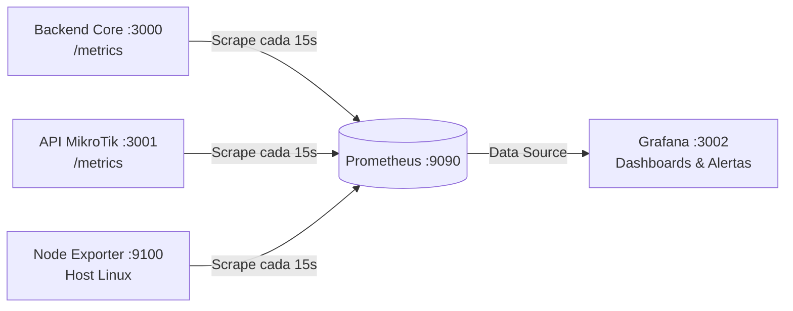

# Guía de Monitoreo y Observabilidad (Prometheus + Grafana)

Esta guía explica paso a paso cómo levantar y utilizar el stack de monitoreo de producción para supervisar caídas de servicios, cuellos de botella (bloqueos del Event Loop), consumo de memoria y saturación de la base de datos.

---

## 1. Arquitectura de Monitoreo



---

## 2. Cómo Levantar el Stack

Desde la raíz del backend o desde la carpeta `deploy/monitoring`:

```bash
# 1. Navegar al directorio de monitoreo
cd deploy/monitoring

# 2. Iniciar los contenedores en segundo plano
docker compose -f docker-compose.monitoring.yml up -d
```

### URLs de acceso local:
* **Prometheus:** `http://localhost:9090` (Base de datos de series temporales).
* **Grafana:** `http://localhost:3002` (Tableros visuales y alertas).
  * **Usuario:** `admin`
  * **Contraseña inicial:** `admin` (podés omitir el cambio pulsando *Skip*).
* **Node Exporter:** `http://localhost:9100/metrics` (Métricas del host/servidor).

---

## 3. Paso 1: Verificar en Prometheus que el Backend responde

1. Abrí en el navegador: `http://localhost:9090/targets`.
2. Verificá que el endpoint **`isp_communication_backend`** esté en estado **`UP`** (color verde).
3. *(Opcional)* En la pestaña principal (`http://localhost:9090`), podés escribir en la barra de consulta:
   ```promql
   isp_http_requests_total
   ```
   y hacer clic en **Execute** para ver las peticiones procesadas.

---

## 4. Paso 2: Conectar Prometheus como Data Source en Grafana

1. Entrá a Grafana: `http://localhost:3002`.
2. En el menú lateral izquierdo, andá a **Connections** > **Data Sources** (o el ícono de engranaje ⚙️ > *Data Sources*).
3. Hacé clic en el botón azul **Add data source** y seleccioná **Prometheus**.
4. En el campo **Prometheus server URL**, escribí exactamente:
   ```text
   http://prometheus:9090
   ```
   *(Nota: Se usa `prometheus:9090` porque dentro de Docker los contenedores se comunican por su nombre de servicio).*
5. Bajá al final de la página y hacé clic en el botón verde **Save & test**. Debe aparecer el mensaje:
   > **«Successfully queried the Prometheus API.»**

---

## 5. Paso 3: Importar el Dashboard de Node.js (ID 11159)

El dashboard oficial **11159** grafica automáticamente todas las métricas nativas de Node.js:

1. En el menú lateral izquierdo de Grafana, hacé clic en **Dashboards**.
2. Arriba a la derecha, hacé clic en **New** > **Import** (o el botón azul *Import*).
3. En el campo **«Find and import dashboards for common applications at grafana.com/dashboards»**, pegá el ID:
   ```text
   11159
   ```
4. Hacé clic en el botón azul **Load**.
5. En la parte inferior, en el menú desplegable **Prometheus**, seleccioná la fuente **Prometheus** creada en el Paso 2.
6. Hacé clic en **Import**.

### ¿Qué métricas verás en este Dashboard?
* **Event Loop Lag (ms):** Tiempo de retraso del bucle de eventos. Si supera 50ms, el servidor está saturado de procesamiento sincrónico.
* **Heap Used vs Heap Total (MB):** Memoria RAM usada por objetos Javascript (alerta temprana de fugas de memoria).
* **Process CPU Usage (%):** Porcentaje de CPU consumido por el proceso Node.js.
* **Active Handles / Requests:** Cantidad de sockets y peticiones activas concurrentes.
* **HTTP Requests Rate (QPS) & Status Codes:** Gráfico de respuestas `2xx`, `4xx` y `5xx`.

---

## 6. Dashboards Adicionales Recomendados

Siguiendo el mismo procedimiento de importación, podés agregar:

1. **Linux Server / Host Metrics (Dashboard ID: `1860`):**
   * Muestra uso de CPU de la máquina, memoria RAM física total/libre, espacio en Disco y tráfico de red del servidor mediante `node-exporter`.

---

## 7. Consultas PromQL Clave para Alertas

Podés configurar alertas en Grafana (**Alerting** > **Alert rules**) con las siguientes expresiones:

### A. Alerta por caída del Backend (Downtime)
```promql
up{job="isp_communication_backend"} == 0
```
*Disparar si dura más de 1 minuto.*

### B. Alerta por pico de errores 500 (Internal Server Error)
```promql
sum(rate(isp_http_requests_total{status_code=~"5.."}[1m])) > 0
```

### C. Alerta por bloqueo crítico del Event Loop (Node.js congelado)
```promql
isp_node_nodejs_eventloop_lag_seconds > 0.1
```
*Disparar si el lag supera los 100ms.*

### D. Alerta por saturación del Pool de PostgreSQL
```promql
isp_pg_pool_connections{state="waiting"} > 5
```
*Disparar si hay más de 5 consultas encoladas esperando conexión.*

---

## 8. Monitoreo de los otros componentes

### Segunda API (`internal_sys_api_mikrotik`)
* Instalar `prom-client` en ese proyecto y exponer el endpoint `GET /metrics`.
* `prometheus.yml` ya está preconfigurado para consultar `http://host.docker.internal:3001/metrics`.

### Frontend (`internal_sys_comunication_frontend` - React / Vite SPA)
* Como el frontend corre en el navegador de los clientes, se monitorea la disponibilidad del servidor web que sirve el HTML (Nginx / Cloudflare) mediante sondas HTTP (código 200) y las excepciones de JavaScript con **Sentry** o **Grafana Faro**.
