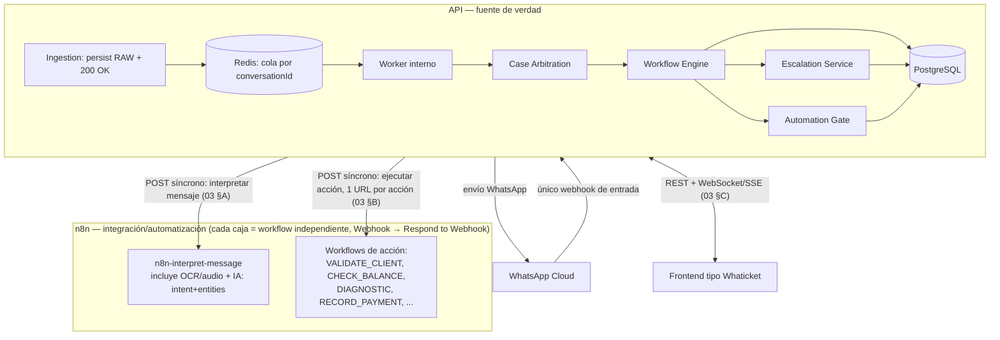

# 00_OVERVIEW.md
## Plataforma omnicanal de atención automatizada — Especificación de construcción (desde cero)

> Este documento y los que lo acompañan (`01` a `05`) son la **fuente única de verdad** para construir el sistema. No dependen de leer el código legacy. `ARCHITECTURE_CURRENT.md` y `MIGRATION_PLAN.md` quedan como contexto histórico de por qué se decidió reconstruir; no son requisitos de diseño.

## 1. Principio rector (no negociable)

```
API   → "¿Qué está pasando y qué debe ocurrir?"   → fuente de verdad, decide, persiste
IA    → "¿Qué quiso decir el usuario?"             → interpreta, nunca gobierna el estado
n8n   → "¿Cómo ejecuto esta integración?"          → ejecuta, nunca decide
UI    → "¿Qué está pasando y quién lo atiende?"    → supervisa, interviene, reactiva
```

Toda decisión de diseño posterior se resuelve contra este principio. Si algo hace que la IA decida negocio, o que n8n almacene estado de negocio, o que la API dependa de memoria implícita: está mal, sin importar qué tan conveniente parezca.

## 2. Stack

- **API**: TypeScript, Express, arquitectura hexagonal (`domain / application / infrastructure / presentation` por módulo — un único composition root).
- **Base de datos de negocio**: PostgreSQL. Es la fuente de verdad de conversaciones, mensajes, casos, workflows, ejecuciones, eventos, escalaciones, automatización. **Debe aprovisionarse** (no existe hoy en la API).
- **Redis**: colas (serialización por conversación), locks, cache de sesión IA. **Nunca** almacenamiento de negocio.
- **n8n**: motor de integración/automatización. Procesa multimedia (OCR, audio), interpreta lenguaje con Ollama/Qwen, ejecuta adapters técnicos (Excel, MikroTik, APIs externas). No decide transiciones ni persiste estado de negocio.
- **WhatsApp Business Cloud**: único canal por ahora, diseñado para admitir más canales luego (el modelo de `Conversation` no debe acoplarse a WhatsApp).
- **Frontend**: tipo Whaticket, consume el contrato de `03_API_CONTRACT.md` §C (no se construye en esta entrega, pero cada endpoint se diseña para él).

## 3. Componentes y flujo



Reglas duras de este flujo:
1. **Solo la API recibe el webhook de WhatsApp.** n8n no tiene trigger de WhatsApp propio; todo mensaje entra por la API.
2. **Solo la API envía mensajes a WhatsApp.** n8n nunca llama directamente al canal — devuelve resultados/texto a la API y esta decide si, cuándo y qué enviar.
3. El webhook de WhatsApp responde `200 OK` inmediatamente tras persistir el mensaje crudo; el procesamiento de IA/integración ocurre **después**, de forma asíncrona respecto al webhook de WhatsApp (se encola por conversación) — pero cada llamada individual de la API hacia n8n (interpretar, ejecutar una acción) es **síncrona**: la API llama a la URL del workflow correspondiente y recibe el resultado en el mismo request HTTP (`Webhook` → `Respond to Webhook`), sin callbacks separados. Detalle completo en `03_API_CONTRACT.md` §A/§B y `04_N8N_WORKFLOW_SPEC.md`.
4. n8n usa su propia memoria (Postgres Chat Memory / pgvector) únicamente como ayuda de continuidad lingüística para el LLM — nunca como fuente para decidir en qué paso del proceso está un caso.
5. Cada acción de negocio (`VALIDATE_CLIENT`, `CHECK_BALANCE`, `DIAGNOSTIC`, ...) es su propio workflow de n8n con su propia URL — no existe un workflow "dispatcher" central. La API mantiene el registro de acción→URL (`04_N8N_WORKFLOW_SPEC.md` §7).
6. Todas las URLs de integración (n8n, WhatsApp) van en variables de entorno; ninguna se hardcodea en nodos ni en código. En particular: usar la URL de **producción** de n8n, no `/webhook-test/…` (esa solo acepta una llamada por activación manual y no sirve para operación continua).

## 4. Documentos de este paquete

| Doc | Contenido |
|---|---|
| `00_OVERVIEW.md` | Este documento |
| `01_DATA_MODEL.md` | Entidades, relaciones, DDL de PostgreSQL, índices, constraints |
| `02_STATE_MACHINE.md` | Estados de `Case`, transiciones, políticas de error/expiración/confianza |
| `03_API_CONTRACT.md` | REST interno (frontend), contrato API↔n8n síncrono (interpretación + acción), eventos en tiempo real |
| `04_N8N_WORKFLOW_SPEC.md` | Especificación del workflow de n8n a construir (nodos, responsabilidades, qué NO debe hacer) |
| `05_BUILD_PLAN.md` | Orden de construcción para un agente de IA, con criterios de aceptación por etapa |

## 5. No-negociables de todo el sistema

- Sin `Record<string, unknown>` para contexto donde el dato es estructurado: cada `workflow_type` tiene un tipo de contexto propio (ver `01_DATA_MODEL.md` §4).
- Sin lógica de negocio en controllers ni en prompts de IA.
- Sin decisiones de negocio tomadas por el LLM: la IA entrega `intent/entities/confidence`, la API decide.
- Idempotencia obligatoria en ingesta de mensajes y en todo intercambio API↔n8n.
- Un único caso automatizado activo por conversación.
- Retomar un proceso pausado nunca reinicia el workflow desde el principio.
- El cliente final nunca ve detalles internos (nombres de workflow, tools, nodos, stack traces).
- Todo error no recuperable tiene una ruta definida (nunca un caso "colgado" sin salida).
