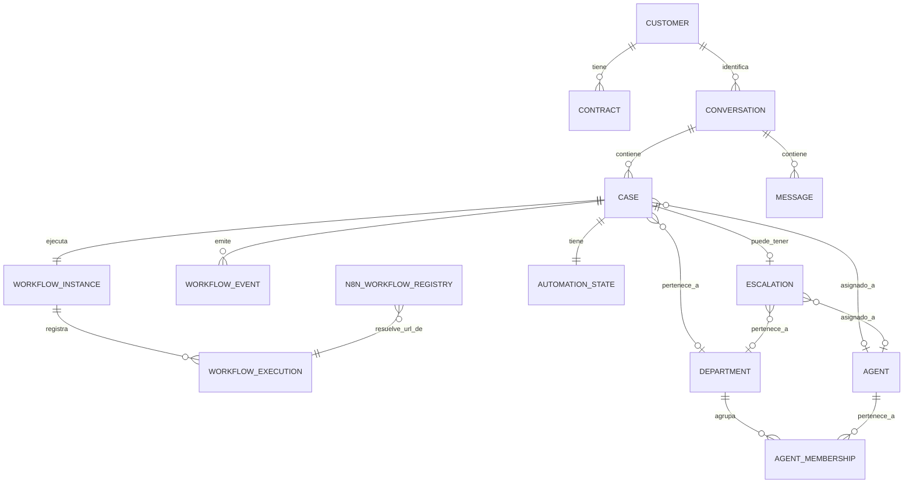

# 01_DATA_MODEL.md

## 1. Diagrama de entidades



**Nota**: `CASE.department_id` y `ESCALATION.department_id` son ahora **nullable** — un caso puede no tener departamento asignado todavía (recién creado, antes de que el motor de workflow lo determine) y una escalación puede caer en el *pool de triage* sin departamento (§7).

## 2. DDL PostgreSQL (referencia — el ORM elegido puede generar equivalente)

```sql
CREATE EXTENSION IF NOT EXISTS "uuid-ossp";

CREATE TABLE department (
  id            UUID PRIMARY KEY DEFAULT uuid_generate_v4(),
  slug          TEXT NOT NULL UNIQUE,
  name          TEXT NOT NULL,
  -- 'shared': todos los agentes pueden VER (no editar) casos de este departamento (default).
  -- 'restricted': solo agentes con membership en este departamento pueden verlo (ej. datos sensibles).
  visibility    TEXT NOT NULL DEFAULT 'shared' CHECK (visibility IN ('shared','restricted')),
  active        BOOLEAN NOT NULL DEFAULT true,
  created_at    TIMESTAMPTZ NOT NULL DEFAULT now()
);

CREATE TABLE agent (
  id                    UUID PRIMARY KEY DEFAULT uuid_generate_v4(),
  name                  TEXT NOT NULL,
  email                 TEXT NOT NULL UNIQUE,
  -- 'agent': atiende casos de su(s) departamento(s).
  -- 'manager': igual que agent + ve el pool de triage sin departamento (§7) + puede reasignar dentro de su área.
  -- 'admin': acceso total, gestiona catálogo de n8n, departamentos, agentes.
  role                  TEXT NOT NULL DEFAULT 'agent' CHECK (role IN ('agent','manager','admin')),
  primary_department_id UUID REFERENCES department(id),
  active                BOOLEAN NOT NULL DEFAULT true,
  -- Opt-in al pool de auto-asignación al escalar (default false). Migración 0011.
  auto_assign_enabled   BOOLEAN NOT NULL DEFAULT false,
  password_hash         TEXT,                         -- argon2; null = sin contraseña todavía (migración 0009)
  created_at            TIMESTAMPTZ NOT NULL DEFAULT now()
);

CREATE TABLE agent_membership (
  agent_id      UUID NOT NULL REFERENCES agent(id) ON DELETE CASCADE,
  department_id UUID NOT NULL REFERENCES department(id) ON DELETE CASCADE,
  PRIMARY KEY (agent_id, department_id)
);

CREATE TABLE customer (
  id            UUID PRIMARY KEY DEFAULT uuid_generate_v4(),
  national_id   TEXT UNIQUE,          -- cédula
  full_name     TEXT,
  wa_phone      TEXT UNIQUE,
  created_at    TIMESTAMPTZ NOT NULL DEFAULT now()
);

CREATE TABLE contract (
  id            UUID PRIMARY KEY DEFAULT uuid_generate_v4(),
  customer_id   UUID NOT NULL REFERENCES customer(id),
  contract_number TEXT NOT NULL,
  sector        TEXT,
  olt_name      TEXT,
  pon           TEXT,
  serial        TEXT,
  router_model  TEXT,
  status        TEXT NOT NULL DEFAULT 'active',
  created_at    TIMESTAMPTZ NOT NULL DEFAULT now(),
  UNIQUE (customer_id, contract_number)
);

CREATE TABLE conversation (
  id                UUID PRIMARY KEY DEFAULT uuid_generate_v4(),
  wa_phone          TEXT NOT NULL,
  customer_id       UUID REFERENCES customer(id),
  active_case_id    UUID,                       -- FK diferida a case (agregada tras crear case)
  status            TEXT NOT NULL DEFAULT 'open' CHECK (status IN ('open','pending','resolved','closed')),
  last_activity_at  TIMESTAMPTZ NOT NULL DEFAULT now(),
  created_at        TIMESTAMPTZ NOT NULL DEFAULT now(),
  updated_at        TIMESTAMPTZ NOT NULL DEFAULT now(),
  wa_profile_name   TEXT                        -- migracion 0010; nombre de agenda de WhatsApp, ver nota abajo
);
CREATE INDEX idx_conversation_wa_phone ON conversation(wa_phone);

> **`conversation.wa_profile_name` vs `customer.full_name`**: son cosas distintas a propósito.
> `wa_profile_name` es el nombre de agenda/perfil de WhatsApp — llega gratis en
> `contacts[].profile.name` de **cada** webhook entrante de Meta (Cloud API), sin
> llamada extra a la API, y se actualiza solo (`ReceiveInboundMessageUseCase`, nunca se
> borra con un valor vacío). `customer.full_name` es el nombre **validado por cédula**
> tras `VALIDATE_CLIENT` — puede diferir del nombre de WhatsApp (ej. alguien atiende
> con el WhatsApp de otra persona). Nunca se deben mezclar.
>
> **La foto de perfil de WhatsApp NO se implementa** — Meta no expone ningún endpoint
> para obtenerla vía la API oficial (Cloud API), por política de privacidad que aplica
> a cualquier negocio, no es una limitación de este backend. Solo librerías no
> oficiales (que simulan WhatsApp Web, ej. Baileys) lo logran, arriesgando que Meta
> banee el número de negocio — fuera de alcance para un sistema de producción real.

CREATE TABLE message (
  id               UUID PRIMARY KEY DEFAULT uuid_generate_v4(),
  conversation_id  UUID NOT NULL REFERENCES conversation(id),
  case_id          UUID,                        -- nullable: no todo mensaje pertenece a un case (ej. saludo)
  direction        TEXT NOT NULL CHECK (direction IN ('inbound','outbound')),
  author           TEXT NOT NULL CHECK (author IN ('customer','ai','agent','system')),
  external_id      TEXT,                        -- waMessageId
  body             TEXT NOT NULL,
  type             TEXT NOT NULL DEFAULT 'text',
  media_id         TEXT,
  mime_type        TEXT,
  caption          TEXT,
  filename         TEXT,
  created_at       TIMESTAMPTZ NOT NULL DEFAULT now(),
  UNIQUE (conversation_id, external_id)          -- idempotencia de ingesta
);
CREATE INDEX idx_message_conversation ON message(conversation_id, created_at);

CREATE TABLE case (
  id                UUID PRIMARY KEY DEFAULT uuid_generate_v4(),
  conversation_id   UUID NOT NULL REFERENCES conversation(id),
  department_id     UUID REFERENCES department(id),   -- nullable: se resuelve por reglas de negocio (02_STATE_MACHINE.md §9), no siempre desde el primer instante
  assigned_agent_id UUID REFERENCES agent(id),         -- humano con derecho de edición (ver §7); null = sin asignar / lo maneja el bot
  workflow_type     TEXT NOT NULL,               -- 'SUPPORT_INTERNET' | 'BILLING_BALANCE' | 'SALES_PACKAGES' | ...
  status            TEXT NOT NULL DEFAULT 'NEW' CHECK (status IN
                       ('NEW','ACTIVE','WAITING_USER','PAUSED','ESCALATED','HUMAN_ACTIVE','COMPLETED','EXPIRED','CANCELLED')),
  context           JSONB NOT NULL DEFAULT '{}', -- tipado a nivel de aplicación, ver §4
  version           INT NOT NULL DEFAULT 1,      -- optimistic concurrency
  last_activity_at  TIMESTAMPTZ NOT NULL DEFAULT now(),
  expires_at        TIMESTAMPTZ,
  created_at        TIMESTAMPTZ NOT NULL DEFAULT now(),
  updated_at        TIMESTAMPTZ NOT NULL DEFAULT now()
);
CREATE INDEX idx_case_conversation ON case(conversation_id);
CREATE INDEX idx_case_department_status ON case(department_id, status);
CREATE INDEX idx_case_assigned_agent ON case(assigned_agent_id) WHERE assigned_agent_id IS NOT NULL;

ALTER TABLE conversation ADD CONSTRAINT fk_conversation_active_case
  FOREIGN KEY (active_case_id) REFERENCES case(id);
ALTER TABLE message ADD CONSTRAINT fk_message_case FOREIGN KEY (case_id) REFERENCES case(id);

CREATE TABLE workflow_instance (
  id                  UUID PRIMARY KEY DEFAULT uuid_generate_v4(),
  case_id             UUID NOT NULL UNIQUE REFERENCES case(id),
  workflow_type       TEXT NOT NULL,
  current_state       TEXT NOT NULL,             -- p.ej. 'VALIDATE_CLIENT'
  version             INT NOT NULL DEFAULT 1,
  created_at          TIMESTAMPTZ NOT NULL DEFAULT now(),
  updated_at          TIMESTAMPTZ NOT NULL DEFAULT now()
);

CREATE TABLE workflow_execution (
  id                    UUID PRIMARY KEY DEFAULT uuid_generate_v4(),
  workflow_instance_id  UUID NOT NULL REFERENCES workflow_instance(id),
  case_id               UUID NOT NULL REFERENCES case(id),
  action                TEXT NOT NULL,           -- 'VALIDATE_CLIENT' | 'CHECK_BALANCE' | ...
  status                TEXT NOT NULL CHECK (status IN ('DISPATCHED','COMPLETED','FAILED')),
  input                 JSONB,
  output                JSONB,
  error                 JSONB,
  idempotency_key       TEXT NOT NULL,
  correlation_id        TEXT NOT NULL,
  started_at            TIMESTAMPTZ NOT NULL DEFAULT now(),
  completed_at          TIMESTAMPTZ,
  UNIQUE (idempotency_key)
);
CREATE INDEX idx_execution_case ON workflow_execution(case_id, started_at);

CREATE TABLE workflow_event (
  id            UUID PRIMARY KEY DEFAULT uuid_generate_v4(),
  case_id       UUID NOT NULL REFERENCES case(id),
  type          TEXT NOT NULL,                   -- ver 03_API_CONTRACT.md §D para el catálogo
  payload       JSONB NOT NULL DEFAULT '{}',
  occurred_at   TIMESTAMPTZ NOT NULL DEFAULT now()
);
CREATE INDEX idx_event_case ON workflow_event(case_id, occurred_at);

CREATE TABLE automation_state (
  case_id         UUID PRIMARY KEY REFERENCES case(id),
  enabled         BOOLEAN NOT NULL DEFAULT true,
  disabled_reason TEXT,
  changed_at      TIMESTAMPTZ NOT NULL DEFAULT now(),
  changed_by      UUID REFERENCES agent(id)       -- null si el cambio lo hizo el sistema
);

CREATE TABLE escalation (
  id                UUID PRIMARY KEY DEFAULT uuid_generate_v4(),
  case_id           UUID NOT NULL REFERENCES case(id),
  department_id     UUID REFERENCES department(id),   -- NULL = pool de triage sin clasificar (02_STATE_MACHINE.md §9), visible a manager/admin
  priority          TEXT NOT NULL DEFAULT 'normal' CHECK (priority IN ('low','normal','high','urgent')),
  reason            TEXT NOT NULL,
  summary           JSONB NOT NULL,               -- estructura de 03_API_CONTRACT.md §D
  status            TEXT NOT NULL DEFAULT 'PENDING' CHECK (status IN ('PENDING','ASSIGNED','RESOLVED')),
  assigned_agent_id UUID REFERENCES agent(id),
  created_at        TIMESTAMPTZ NOT NULL DEFAULT now(),
  resolved_at       TIMESTAMPTZ
);
CREATE INDEX idx_escalation_department_status ON escalation(department_id, status);

-- Catálogo de workflows de n8n (acción -> URL), editable sin redeploy vía /api/admin/n8n-workflows.
-- Reemplaza el enfoque de una variable de entorno por acción (04_N8N_WORKFLOW_SPEC.md §7).
CREATE TABLE n8n_workflow_registry (
  action        TEXT PRIMARY KEY,              -- 'VALIDATE_CLIENT' | 'CHECK_BALANCE' | 'DIAGNOSTIC' | 'QUERY_KNOWLEDGE_BASE' | ...
  -- 'case_action': paso de un WorkflowDefinition, lo llama el motor de workflow durante una conversación.
  -- 'admin_action': herramienta de administración de contenido (ej. ingesta de documentos al RAG), nunca la llama el motor de workflow de un caso.
  category      TEXT NOT NULL DEFAULT 'case_action' CHECK (category IN ('case_action','admin_action')),
  url           TEXT NOT NULL,
  description   TEXT,
  timeout_ms    INT NOT NULL DEFAULT 8000,
  max_retries   INT NOT NULL DEFAULT 2,
  active        BOOLEAN NOT NULL DEFAULT true,
  updated_at    TIMESTAMPTZ NOT NULL DEFAULT now(),
  updated_by    UUID REFERENCES agent(id)
);

CREATE TABLE audit_event (
  id            UUID PRIMARY KEY DEFAULT uuid_generate_v4(),
  action        TEXT NOT NULL,
  resource_type TEXT NOT NULL,
  resource_id   TEXT NOT NULL,
  metadata      JSONB NOT NULL DEFAULT '{}',
  actor_id      UUID,
  occurred_at   TIMESTAMPTZ NOT NULL DEFAULT now()
);
CREATE INDEX idx_audit_resource ON audit_event(resource_type, resource_id, occurred_at);
```

## 3. Reglas de integridad relevantes

- `message (conversation_id, external_id)` único → cualquier reintento de Meta con el mismo `waMessageId` es un no-op (se detecta el conflicto y se responde el mensaje ya existente, no se duplica).
- `workflow_execution.idempotency_key` único → una acción reintentada con la misma key no se reaplica.
- `conversation.active_case_id` solo puede apuntar a un `case` en estado `ACTIVE` o `WAITING_USER` — se valida a nivel de aplicación (no CHECK cruzado por simplicidad de DDL, pero sí invariante de dominio obligatoria).
- `case.version` y `workflow_instance.version`: toda actualización usa `UPDATE ... WHERE id = :id AND version = :expected`; conflicto de fila (`0 rows affected`) implica reintento a nivel de aplicación (optimistic concurrency, ver `02_STATE_MACHINE.md`).

## 4. Contextos tipados por `workflow_type`

`case.context` es JSONB en la base, pero la capa de aplicación nunca lo trata como `Record<string, unknown>`: se define un discriminated union en TypeScript, y cada workflow serializa/deserializa su propio tipo.

```ts
type SupportInternetContext = {
  client?: { nationalId: string; fullName: string };
  contract?: { id: string; sector: string; oltName: string; pon: string; serial: string; router: string };
  balance?: { hasDebt: boolean; amount?: number };
  diagnostic?: {
    status: string;
    lastQuestion?: string;
    result?: string;
    /** Telemetria real de la ONU (ver nota debajo) — puede faltar si el microservicio no logro leerla. */
    technical?: SupportInternetDiagnosticTechnical;
  };
};

/**
 * Aplanado de `TechnicalDataResponseDTO` (mikrotik_api: brand/onu/state/power/mac)
 * a nombres entendibles por un agente sin conocimiento de redes. Se persiste tal
 * cual (§DIAGNOSTIC más abajo) y se reutiliza sin duplicar el mapeo en el resumen
 * de escalación (`normalizeTechnicalData`, `support-internet.context.ts`).
 */
type SupportInternetDiagnosticTechnical = {
  brand?: string;
  onuModel?: string;
  onuSerial?: string;
  macAddress?: string;
  /** Potencia óptica recibida (RX) en dBm — mientras más cercano a 0, más fuerte. */
  opticalPowerDbm?: number;
  runState?: string;
  adminState?: string;
  channel?: string;
};

type BillingBalanceContext = {
  /** balance = consulta de saldo; record_payment = registrar comprobante. */
  purpose?: "balance" | "record_payment";
  client?: { nationalId: string; fullName: string };
  invoices?: { id: string; amount: number; dueDate: string }[];
  balance?: { hasDebt: boolean; amount?: number };
  payment?: {
    amount?: number;
    reference?: string;
    date?: string;
    status?: "PENDING" | "RECORDED" | "REJECTED";
  };
};

type SalesPackagesContext = {
  purpose?: "packages" | "upgrade";
  requestedSpeed?: string;
  currentPlan?: { name: string; speed: string };
  offer?: { planId: string; name?: string; price: number; speed?: string; answer?: string };
};

type GeneralInquiryContext = {
  question: string;
  retrieved?: { found: boolean; answer?: string; sources?: string[] };
};

type CaseContext =
  | { workflowType: "SUPPORT_INTERNET"; data: SupportInternetContext }
  | { workflowType: "BILLING_BALANCE"; data: BillingBalanceContext }
  | { workflowType: "SALES_PACKAGES"; data: SalesPackagesContext }
  | { workflowType: "GENERAL_INQUIRY"; data: GeneralInquiryContext };
```

Cada `WorkflowDefinition` (ver `02_STATE_MACHINE.md`) declara su tipo de contexto asociado; el motor nunca manipula `context` como objeto genérico fuera de la frontera de (de)serialización.

**`waitingAttempts`**: no es parte del contexto tipado de negocio de arriba — es un contador de control del motor (`02_STATE_MACHINE.md` §13), se guarda junto al contexto (ej. `case.context._engine.waitingAttempts`) y se resetea cada vez que el `Case` entra a un `WaitingStep` nuevo. No lo mezcles con los campos de negocio (`client`, `contract`, etc.) — es metadata del motor, no un dato que la IA deba ver ni tocar.

## 5. Datos técnicos del cliente — regla de origen

**Nota (2026-08-11)**: el microservicio de diagnóstico (`mikrotik_api`) devuelve, junto al resultado del diagnóstico, un bloque `technical` con la lectura real de la ONU (estado, potencia óptica RX, MAC, modelo). `normalizeDiagnosticResult` (`support-internet.workflow.ts`) lo aplana con `normalizeTechnicalData` y lo persiste en `diagnostic.technical` — se conserva sea el diagnóstico automático resoluble o no, porque es justo cuando se escala que el agente humano más lo necesita. La misma función se reutiliza en `CaseSummaryBuilderService` para que el resumen de escalación (`GET /api/cases/:id/summary`) también lo muestre limpio, sin el ruido interno del microservicio (`_history`, `failedStep`).

Campos como `sector`, `oltName`, `pon`, `serial`, `router` **siempre** se leen de `contract` (ya resuelto por la acción `VALIDATE_CLIENT` y guardado en `case.context.data.contract`). Ninguna acción hacia n8n le pide estos valores al LLM; se inyectan como `input` de la acción desde el contexto ya persistido (ver `03_API_CONTRACT.md` §B.2, `04_N8N_WORKFLOW_SPEC.md` §3.1).

**Nota de mapeo (Anti-Corruption Layer, `docs/skills/design-patterns-backend.md`)**: el workflow real de n8n (`find-client-contract`) devuelve los datos técnicos anidados bajo `contract.router.{sector, olt_name, pon, serial}`. El `n8n-gateway` (adapter, del lado de la API) traduce esa forma externa al `SupportInternetContext.contract` interno — **siempre en `camelCase`**, es el formato estándar de todo el contrato de la API (`03_API_CONTRACT.md`), sin importar cómo nombre sus campos cada sistema externo. El paso `VALIDATE_CLIENT` del workflow también debe contemplar el caso de múltiples contratos (pedir dato de desambiguación: dirección o nombre) antes de continuar.

La traducción inversa (de `camelCase` en el `input` que envía la API, a lo que cada sistema externo específico necesite — por ejemplo `olt_name` snake_case para el microservicio de diagnóstico) es responsabilidad del propio nodo de n8n (`HTTP Request`/`Set`) que ya hace ese mapeo campo por campo — no del contrato de la API. Esto mantiene el contrato de la API uniforme sin perseguir la convención de cada integración nueva.

## 6. Campos calculados (no persistidos)

Algunos campos que expone la API **no son columnas**, se calculan al leer:

| Campo | De dónde sale |
|---|---|
| `ConversationDto.lastMessagePreview` | `SELECT` del último `message` de esa `conversation_id` (por `created_at DESC LIMIT 1`), no una columna en `conversation` |
| `CaseDto.automation` | join a `automation_state` por `case_id` |

Nunca dupliques estos datos con un `UPDATE` a `conversation`/`case` — la fuente sigue siendo `message`/`automation_state`.

## 7. Visibilidad y roles (agentes)

- **`agent.role`**: `agent | manager | admin`.
- **Departamento (`department.visibility = 'shared'`, default)**: cualquier agente autenticado puede **ver** (lectura) casos/conversaciones de cualquier departamento — pero solo puede **escribir** (responder, tomar acciones) si `case.assigned_agent_id = self` o el caso está `assigned_agent_id IS NULL` (puede reclamarlo, ver `03_API_CONTRACT.md` §C.2 `claim`). Si `department.visibility = 'restricted'`, la lectura también se limita a agentes con `agent_membership` en ese departamento.
- **Pool de triage**: casos/escalaciones con `department_id IS NULL` (intención no clasificable, ver `02_STATE_MACHINE.md` §9) son visibles para todo `role IN ('manager','admin')`, sin importar su departamento primario — hasta que alguno lo reclama y le asigna un `department_id`, momento en el que pasa a las reglas normales de arriba.
- `admin` ve y puede actuar sobre todo, incluye gestión del catálogo `n8n_workflow_registry`.

