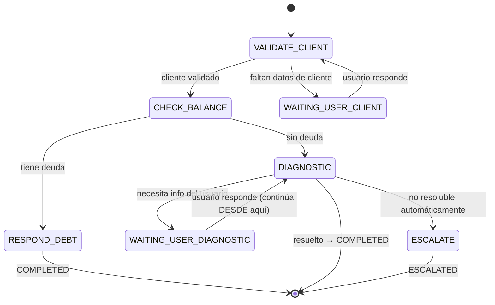

# 02_STATE_MACHINE.md

## 1. Estados del `Case`

| Estado | Significado | Automatización posible |
|---|---|---|
| `NEW` | Caso creado, ningún paso procesado aún | sí |
| `ACTIVE` | Workflow corriendo; es el caso activo de la conversación | sí |
| `WAITING_USER` | Pausado esperando un dato/confirmación del cliente | sí |
| `PAUSED` | El usuario cambió de tema; espera ser retomado | sí (al reactivarse) |
| `ESCALATED` | Requiere humano; automatización deshabilitada | no |
| `HUMAN_ACTIVE` | Un agente está atendiendo activamente | no (salvo reactivación explícita) |
| `COMPLETED` | Resuelto | n/a |
| `EXPIRED` | Sin actividad más allá del umbral configurado | n/a |
| `CANCELLED` | Cancelado explícitamente | n/a |

`automation_state.enabled` es **independiente** del estado del caso: `true` por defecto en `NEW/ACTIVE/WAITING_USER/PAUSED`; se fuerza a `false` al entrar a `ESCALATED`/`HUMAN_ACTIVE`; solo una acción explícita de agente (`POST /api/cases/:id/reactivate-automation`) lo vuelve a `true`, conservando el `context` acumulado.

## 2. Transiciones válidas

| Desde | Evento | Hacia | Guarda |
|---|---|---|---|
| `NEW` | primer paso ejecutado sin error | `ACTIVE` | — |
| `ACTIVE` | paso requiere dato del usuario | `WAITING_USER` | — |
| `WAITING_USER` | usuario responde, interpretado como respuesta al paso pendiente | `ACTIVE` | `interpretation.type ∈ {ANSWER, CONTINUE}` sobre este caso |
| `ACTIVE`/`WAITING_USER` | nueva intención distinta, alta confianza | `PAUSED` (este caso) + activa/crea otro `Case` | `confidence ≥ threshold(intent)` y `intent ≠ workflow_type` actual |
| `PAUSED` | usuario retoma el tema | `ACTIVE` | caso no expirado |
| `ACTIVE`/`WAITING_USER` | error no recuperable / baja confianza sostenida / excepción técnica / solicitud explícita de humano | `ESCALATED` | ver §4 |
| `ESCALATED` | agente toma el caso | `HUMAN_ACTIVE` | agente pertenece al `department` del caso (o es admin global) |
| `HUMAN_ACTIVE` | agente cierra | `COMPLETED` | — |
| `HUMAN_ACTIVE` | agente reactiva automatización | `ACTIVE` | contexto se conserva, no se reinicia |
| `ACTIVE` | workflow llega a paso terminal exitoso | `COMPLETED` | — |
| cualquiera activo | `last_activity_at + N horas` sin actividad | `EXPIRED` | `N` configurable por `workflow_type`, ver §5 |
| `ACTIVE`/`PAUSED`/`WAITING_USER` | cancelación explícita | `CANCELLED` | — |

**Regla dura:** ninguna transición vuelve a `NEW` desde otro estado. Retomar nunca es reiniciar.

## 3. `SUPPORT_INTERNET` — ejemplo de referencia para construir el motor

Regla explícita: al volver de `WAITING_USER_DIAGNOSTIC` el motor continúa **desde `DIAGNOSTIC`**, nunca desde `VALIDATE_CLIENT` ni `CHECK_BALANCE`, salvo que una regla de negocio lo exija (p. ej. han pasado más de X horas y se requiere re-validar saldo).

## 4. Un solo caso automatizado activo por conversación — arbitraje

`conversation.active_case_id` apunta al único `Case` en estado automatizable. Ante una nueva interpretación de intención mientras hay un caso activo, la API (no el LLM) decide:

1. Si la intención coincide con el `workflow_type` del caso activo → continuar.
2. Si es `CONTINUE`/`ANSWER`/`CONFIRM` genérico → continuar el caso activo (nunca crear uno nuevo).
3. Si es `NEW_INTENT`/`CHANGE_TOPIC` distinto y de alta confianza → `PAUSE` el caso activo, buscar un `Case` `PAUSED` del nuevo `workflow_type` no expirado (reactivarlo) o crear uno nuevo, y activarlo.
4. Si `interpretation.type = UNCLEAR` o confianza media → responder pidiendo aclaración, sin crear ni pausar nada.

Esta lógica vive en un `CaseArbitrationService` de la API — nunca en el prompt del LLM.

## 5. Política de errores

| Tipo | Ejemplos | Acción por defecto |
|---|---|---|
| `BUSINESS_ERROR` | Cliente sin contrato, dato inválido | Responder al usuario, permanecer en el paso |
| `VALIDATION_ERROR` | Formato de dato incorrecto | Re-preguntar |
| `TIMEOUT` | n8n/herramienta no responde | Retry (idempotente) → agotado → `ESCALATE` |
| `EXTERNAL_SERVICE_ERROR` | MikroTik/Excel caído | Retry limitado → `ESCALATE` |
| `AI_ERROR` | LLM sin respuesta interpretable | Reintentar 1 vez → `UNCLEAR` o `ESCALATE` si el paso era crítico |
| `UNSUPPORTED` | Intención sin workflow definido | Responder que se deriva → `ESCALATE` al departamento por defecto |
| `NOT_FOUND` | Recurso no encontrado | Tratar como `BUSINESS_ERROR` |

Todo error no recuperable tiene ruta definida; no todo error escala.

## 6. Reintentos e idempotencia

- Acciones idempotentes (consultas de solo lectura: balance, contrato, diagnóstico): retryable con backoff exponencial, `maxAttempts` configurable por acción.
- Acciones no idempotentes (enviar WhatsApp, registrar un pago): `idempotency_key` obligatoria (`hash(caseId, action, canonicalize(input))`); un reintento con la misma key devuelve el resultado ya registrado, no repite el efecto.
- Acciones que agotan reintentos quedan `workflow_execution.status = FAILED` y disparan `CASE_ESCALATED` si el paso era bloqueante.

## 7. Confianza de IA

`confidence < threshold(intent)`:
- Si hay caso `ACTIVE`/`WAITING_USER` → se asume `CONTINUE` sobre ese caso; si el paso pendiente requiere el dato, se re-pregunta con el texto original del paso.
- Si no hay caso activo → se pide aclaración con opciones, nunca se adivina el workflow.
- `threshold` configurable por `intent` (p. ej. `billing.*` exige más certeza que `support.*` por implicar montos).

## 8. Expiración

`case.expires_at = last_activity_at + expiration_hours(workflow_type)`, configurable por tipo de workflow (nunca hardcodeado). Un proceso periódico (o cálculo perezoso al leer el caso) mueve a `EXPIRED` los casos vencidos en estado no terminal. Un caso `EXPIRED` no bloquea abrir un `Case` nuevo del mismo `workflow_type` en la misma conversación más adelante.
