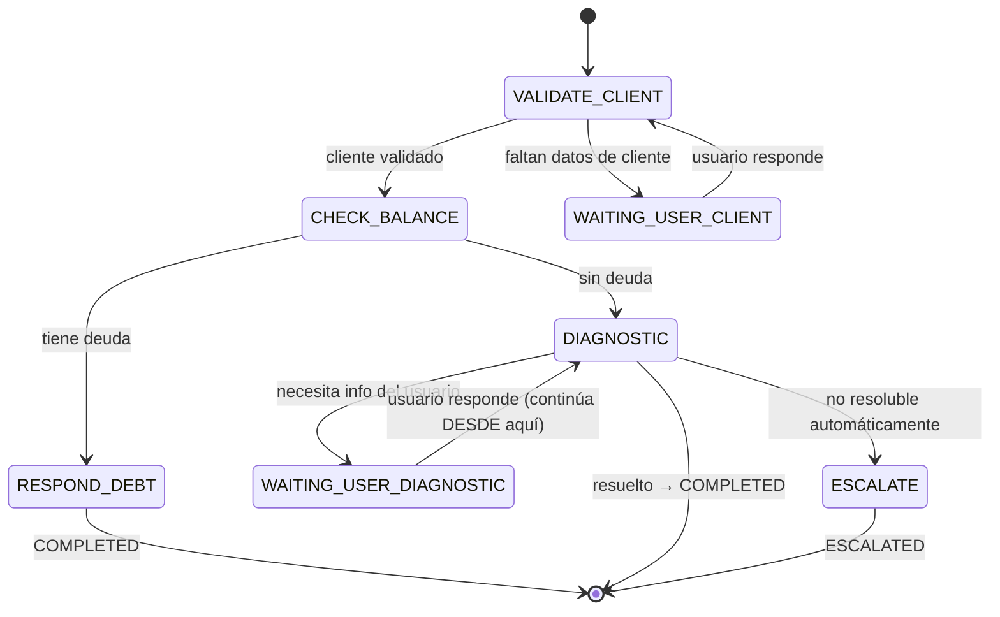
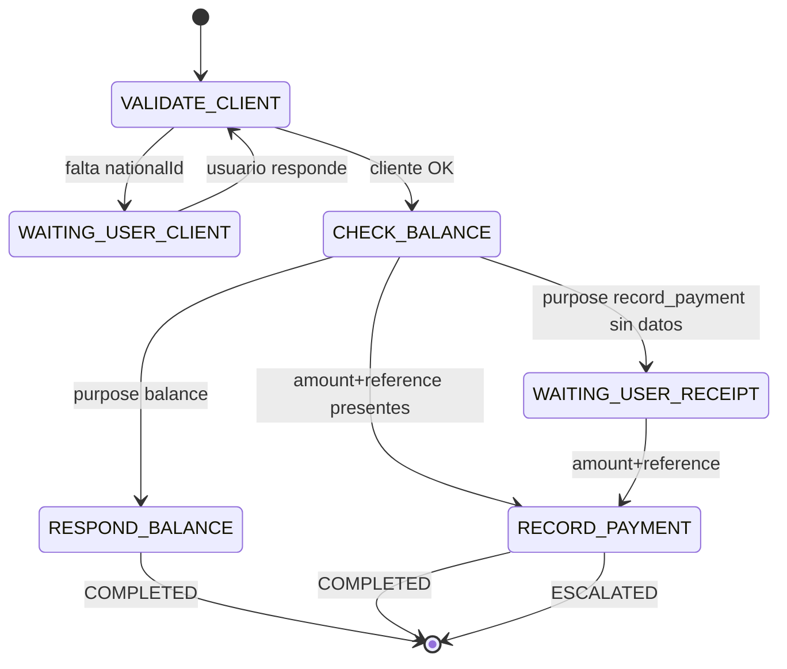
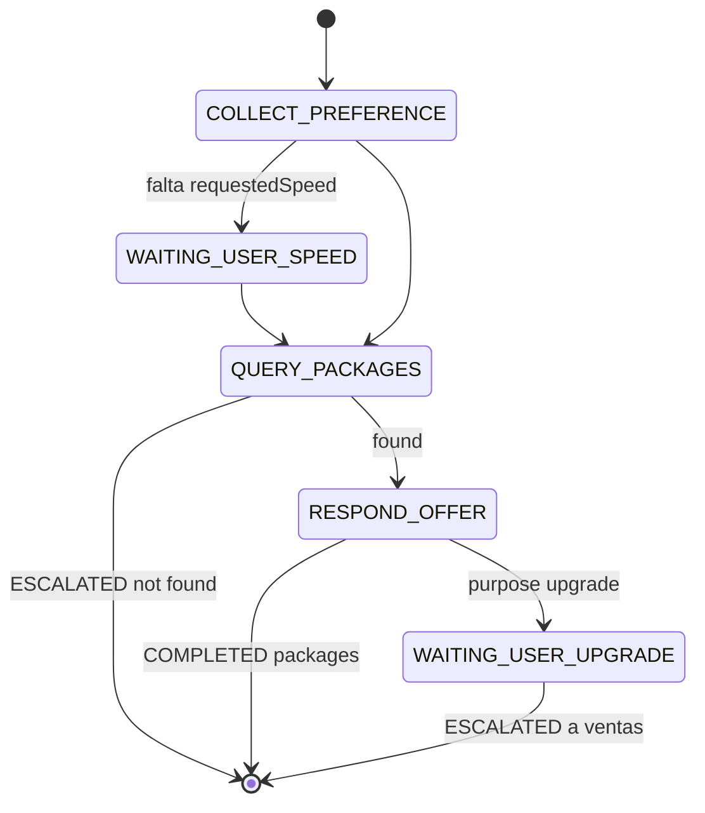

# 02_STATE_MACHINE.md

## 1. Estados del `Case`

| Estado | Significado | Automatización posible |
|---|---|---|
| `NEW` | Caso creado, ningún paso procesado aún | sí |
| `ACTIVE` | Workflow corriendo; es el caso activo de la conversación | sí |
| `WAITING_USER` | Pausado esperando un dato/confirmación del cliente | sí |
| `PAUSED` | El usuario cambió de tema; espera ser retomado | sí (al reactivarse) |
| `ESCALATED` | Requiere humano; automatización deshabilitada | no |
| `HUMAN_ACTIVE` | Un agente está atendiendo activamente | no (salvo reactivación explícita) |
| `COMPLETED` | Resuelto | n/a |
| `EXPIRED` | Sin actividad más allá del umbral configurado | n/a |
| `CANCELLED` | Cancelado explícitamente | n/a |

`automation_state.enabled` es **independiente** del estado del caso: `true` por defecto en `NEW/ACTIVE/WAITING_USER/PAUSED`; se fuerza a `false` al entrar a `ESCALATED`/`HUMAN_ACTIVE`; solo una acción explícita de agente (`POST /api/cases/:id/reactivate-automation`) lo vuelve a `true`, conservando el `context` acumulado.

## 2. Transiciones válidas

| Desde | Evento | Hacia | Guarda |
|---|---|---|---|
| `NEW` | primer paso ejecutado sin error | `ACTIVE` | — |
| `ACTIVE` | paso requiere dato del usuario | `WAITING_USER` | — |
| `WAITING_USER` | usuario responde, interpretado como respuesta al paso pendiente | `ACTIVE` | `interpretation.type ∈ {ANSWER, CONTINUE}` sobre este caso |
| `ACTIVE`/`WAITING_USER` | nueva intención distinta, alta confianza | `PAUSED` (este caso) + activa/crea otro `Case` | `confidence ≥ threshold(intent)` y `intent ≠ workflow_type` actual |
| `PAUSED` | usuario retoma el tema | `ACTIVE` | caso no expirado |
| `ACTIVE`/`WAITING_USER` | error no recuperable / baja confianza sostenida / excepción técnica / solicitud explícita de humano | `ESCALATED` | ver §4 |
| `ESCALATED` | agente toma el caso | `HUMAN_ACTIVE` | agente pertenece al `department` del caso (o es admin global) |
| `HUMAN_ACTIVE` | agente cierra | `COMPLETED` | — |
| `HUMAN_ACTIVE` | agente reactiva automatización | `ACTIVE` | contexto se conserva, no se reinicia |
| `ACTIVE` | workflow llega a paso terminal exitoso | `COMPLETED` | — |
| cualquiera activo | `last_activity_at + N horas` sin actividad | `EXPIRED` | `N` configurable por `workflow_type`, ver §5 |
| `ACTIVE`/`PAUSED`/`WAITING_USER` | cancelación explícita | `CANCELLED` | — |

**Regla dura:** ninguna transición vuelve a `NEW` desde otro estado. Retomar nunca es reiniciar.

## 3. `SUPPORT_INTERNET` — ejemplo de referencia para construir el motor



Regla explícita: al volver de `WAITING_USER_DIAGNOSTIC` el motor continúa **desde `DIAGNOSTIC`**, nunca desde `VALIDATE_CLIENT` ni `CHECK_BALANCE`, salvo que una regla de negocio lo exija (p. ej. han pasado más de X horas y se requiere re-validar saldo).

## 3.1 `BILLING_BALANCE` (Etapa 8)



WaitingSteps (§13): `WAITING_USER_CLIENT` (`requireAll: ["nationalId"]`), `WAITING_USER_RECEIPT` (`requireAll: ["amount","reference"]`). Reutiliza acciones genéricas `VALIDATE_CLIENT`/`CHECK_BALANCE` y `RECORD_PAYMENT`.

## 3.2 `SALES_PACKAGES` (Etapa 8)



Usa `QUERY_KNOWLEDGE_BASE`. Un upgrade confirmado escala a departamento `SALES` (no inventa acción de cambio de plan en n8n).

## 4. Un solo caso automatizado activo por conversación — arbitraje

`conversation.active_case_id` apunta al único `Case` en estado automatizable. Ante una nueva interpretación de intención mientras hay un caso activo, la API (no el LLM) decide:

1. Si la intención coincide con el `workflow_type` del caso activo → continuar.
2. Si es `CONTINUE`/`ANSWER`/`CONFIRM` genérico → continuar el caso activo (nunca crear uno nuevo).
3. Si es `NEW_INTENT`/`CHANGE_TOPIC` distinto y de alta confianza → `PAUSE` el caso activo, buscar un `Case` `PAUSED` del nuevo `workflow_type` no expirado (reactivarlo) o crear uno nuevo, y activarlo.
4. Si `interpretation.type = UNCLEAR` o confianza media → responder pidiendo aclaración, sin crear ni pausar nada.

Esta lógica vive en un `CaseArbitrationService` de la API — nunca en el prompt del LLM.

## 5. Política de errores

| Tipo | Ejemplos | Acción por defecto |
|---|---|---|
| `BUSINESS_ERROR` | Cliente sin contrato, dato inválido | Responder al usuario, permanecer en el paso |
| `VALIDATION_ERROR` | Formato de dato incorrecto | Re-preguntar |
| `TIMEOUT` | n8n/herramienta no responde | Retry (idempotente) → agotado → `ESCALATE` |
| `EXTERNAL_SERVICE_ERROR` | MikroTik/Excel caído | Retry limitado → `ESCALATE` |
| `AI_ERROR` | LLM sin respuesta interpretable | Reintentar 1 vez → `UNCLEAR` o `ESCALATE` si el paso era crítico |
| `UNSUPPORTED` | Intención sin workflow definido | Responder que se deriva → `ESCALATE` al departamento por defecto |
| `NOT_FOUND` | Recurso no encontrado | Tratar como `BUSINESS_ERROR` |

Todo error no recuperable tiene ruta definida; no todo error escala.

## 6. Reintentos e idempotencia

- Acciones idempotentes (consultas de solo lectura: balance, contrato, diagnóstico): retryable con backoff exponencial, `maxAttempts` configurable por acción.
- Acciones no idempotentes (enviar WhatsApp, registrar un pago): `idempotency_key` obligatoria (`hash(caseId, action, canonicalize(input))`); un reintento con la misma key devuelve el resultado ya registrado, no repite el efecto.
- Acciones que agotan reintentos quedan `workflow_execution.status = FAILED` y disparan `CASE_ESCALATED` si el paso era bloqueante.

## 7. Confianza de IA

`confidence < threshold(intent)`:
- Si hay caso `ACTIVE`/`WAITING_USER` → se asume `CONTINUE` sobre ese caso; si el paso pendiente requiere el dato, se re-pregunta con el texto original del paso.
- Si no hay caso activo → se pide aclaración con opciones, nunca se adivina el workflow.
- `threshold` configurable por `intent` (p. ej. `billing.*` exige más certeza que `support.*` por implicar montos).

## 8. Expiración

`case.expires_at = last_activity_at + expiration_hours(workflow_type)`, configurable por tipo de workflow (nunca hardcodeado). Un proceso periódico (o cálculo perezoso al leer el caso) mueve a `EXPIRED` los casos vencidos en estado no terminal. Un caso `EXPIRED` no bloquea abrir un `Case` nuevo del mismo `workflow_type` en la misma conversación más adelante.

## 9. Departamento es ortogonal al motor de workflow

**El departamento nunca determina qué acción de n8n se ejecuta.** El motor de workflow (`WorkflowDefinition`) decide el siguiente paso únicamente en función de `workflow_type` + `current_state` + resultado del paso anterior — nunca consulta `department_id`. Un mismo `Case` de `BILLING_BALANCE` puede, dentro de su propio flujo, terminar llamando a `RECORD_PAYMENT` y `APPLY_BANK_ACCOUNT` sin que eso implique "saltar a otro departamento": son pasos internos de ese workflow.

`department_id` se resuelve por una tabla de mapeo simple `workflow_type → department_id` (configuración, no código):

```
SUPPORT_INTERNET  → SUPPORT
BILLING_BALANCE   → BILLING
SALES_PACKAGES    → SALES
GENERAL_INQUIRY   → null   (sin departamento; solo se le asigna uno si no se encuentra respuesta y se decide escalar — candidato por defecto: SALES, a confirmar con el negocio)
```

Con override explícito cuando el negocio lo requiera (ej. `SALES_PACKAGES` que escala nunca cae en `SUPPORT`, va siempre a `SALES` — caso E del negocio original). Esto reemplaza cualquier heurística de keywords sobre el texto del mensaje (el problema detectado en el sistema legacy, `docs/spec/historical/ARCHITECTURE_CURRENT.md`).

Si el `workflow_type` no puede determinarse (intención no clasificable, ver §10), el caso queda temporalmente **sin `department_id`** — no se le asigna un departamento por defecto a ciegas.

## 10. Intención no clasificable — pool de triage

Cuando la interpretación de IA es `UNCLEAR` de forma sostenida (reintento agotado, §7) o el `intent` no mapea a ningún `WorkflowDefinition` conocido (`UNSUPPORTED`, §5):

1. Se crea (o se mantiene) el `Case` con `workflow_type = null`/`"UNCLASSIFIED"` y `department_id = NULL`.
2. Se crea una `Escalation` con `department_id = NULL` — visible para todo agente con `role IN ('manager','admin')` (`01_DATA_MODEL.md` §7), no solo el admin global.
3. Un manager/admin, al revisarlo, lo reclasifica: asigna `workflow_type`/`department_id` manualmente, o lo atiende directo como humano.
4. Al cliente se le responde con un mensaje de negocio neutro ("un asesor revisará tu solicitud"), nunca "no pude entender tu mensaje" en crudo.

## 11. Asignación humana y edición

`case.assigned_agent_id` determina quién puede escribir (responder, ejecutar acciones de agente) sobre un caso una vez que pasó a `HUMAN_ACTIVE`/`ESCALATED`:
- `NULL` → cualquier agente con visibilidad sobre ese caso puede **reclamarlo** (`POST /api/cases/:id/claim`, `03_API_CONTRACT.md` §C.2), lo que fija `assigned_agent_id`.
- Asignado → solo ese agente (o un `manager`/`admin` de su departamento, vía `reassign`) puede actuar; el resto de agentes lo ve en modo lectura si `department.visibility='shared'`.
- Un caso puede ser visible sin estar asignado (bandeja compartida); la asignación es lo que bloquea la edición, no la visibilidad.

## 12. Buffer de mensajes (debounce) y composición de respuesta

**Buffer/debounce**: vive en la API (Redis), no en n8n. Cada mensaje inbound de una conversación reprograma un temporizador corto (configurable, p. ej. 4-5s). Al vencer sin mensajes nuevos, se toman todos los mensajes acumulados desde el último procesamiento y se pasan **juntos** a interpretación (uno o varios mensajes concatenados/ordenados cronológicamente como una sola unidad de trabajo) — reemplaza el patrón de Data Table + `Wait` que existía en n8n.

**Interpretación y composición de respuesta**: ambas viven en la API, vía `AIProviderPort` (no en n8n — ver `03_API_CONTRACT.md` §A y `04_N8N_WORKFLOW_SPEC.md` §1):
- `interpretMessage(...)` → `{ type, intent, entities, confidence }`, usado por `CaseArbitrationService`/el motor para decidir transición.
- `composeReply(...)` → texto final para el cliente. Cada estado de un `WorkflowDefinition` declara **o bien** un template estático con variables del `context` (preferido: determinista, fácil de auditar, cumple "el cliente nunca ve detalles internos" sin depender de que el LLM se comporte) **o bien** delega en `composeReply` para redactar naturalmente a partir del resultado estructurado del paso — nunca al revés (el LLM nunca decide *qué* decir, solo puede ayudar a decir *cómo* decirlo de forma más natural sobre una plantilla/resultado ya decidido por la API).

## 13. Datos esperados por paso, reintentos, y escalación por información insuficiente

Este es el mecanismo general (no un parche por campo): **cada estado que entra en `WAITING_USER` declara explícitamente qué datos necesita para continuar**, y ese contrato (no la IA) es lo que decide cuándo hay suficiente información y cuándo hay que escalar.

```ts
type WaitingStep = {
  pendingQuestion: string;         // texto exacto que se le muestra al cliente (o template hint para composeReply)
  requireAll?: string[];           // TODAS estas claves de "entities" deben estar presentes para continuar
  requireAny?: string[];           // BASTA con UNA de estas claves (ej. desambiguar contrato: nombre O dirección O serial)
  maxAttempts?: number;            // default 2
};
```

Ejemplos:
- `VALIDATE_CLIENT` (primera pregunta): `{ pendingQuestion: "¿podrías confirmar tu número de cédula?", requireAll: ["nationalId"] }`.
- `VALIDATE_CLIENT` (múltiples contratos encontrados, desambiguar): `{ pendingQuestion: "Encontré más de un contrato a tu nombre, ¿me confirmas tu dirección o el nombre completo del titular?", requireAny: ["address", "fullName"] }`.
- `RECORD_PAYMENT` (esperando comprobante): `{ pendingQuestion: "Envíame la foto de tu comprobante de pago", requireAll: ["amount", "reference"] }` — los valores de `entities` en este caso salen de `extractReceiptData` (`03_API_CONTRACT.md` §A.2), fusionados al mismo `entities` que evalúa este contrato, no por un camino aparte.

**Flujo de decisión** (en el motor de workflow, no en el prompt):
1. Interpretación llega con `type=ANSWER`/`CONTINUE` sobre el paso actual.
2. Si `requireAll` está definido: ¿están **todas** esas claves presentes en `entities` (no vacías)? Si sí → continuar con esos valores como `input` de la siguiente acción.
3. Si `requireAny` está definido: ¿está **al menos una**? Si sí → continuar.
4. Si falta algo: incrementar `case.context.waitingAttempts` (contador por paso, se resetea al entrar a un `WaitingStep` nuevo).
   - `waitingAttempts < maxAttempts` → volver a preguntar, idealmente solo por lo que falta (`composeReply` recibe `missingFields` para redactar algo como "no logré leer el número de comprobante, ¿me lo confirmas?" en vez de repetir la pregunta completa desde cero — evita el bug de "pregunta idéntica 3 veces").
   - `waitingAttempts >= maxAttempts` → `ESCALATED` (`automation.enabled=false`), con `reason: "No fue posible obtener {campos faltantes} tras {N} intentos"` en el resumen estructurado (`03_API_CONTRACT.md` §D) — el departamento de la escalación es el mismo del `Case` (`§9` de este documento), no uno genérico.

**La IA nunca decide escalar.** Solo reporta qué pudo extraer (`entities`) y con qué confianza; el motor es quien compara eso contra `requireAll`/`requireAny` y decide reintentar o escalar. Esto es deliberado: si dejáramos que el LLM decidiera "no puedo procesar esto, escalo", perderíamos determinismo justo en el punto más importante (cuándo un cliente necesita un humano).


