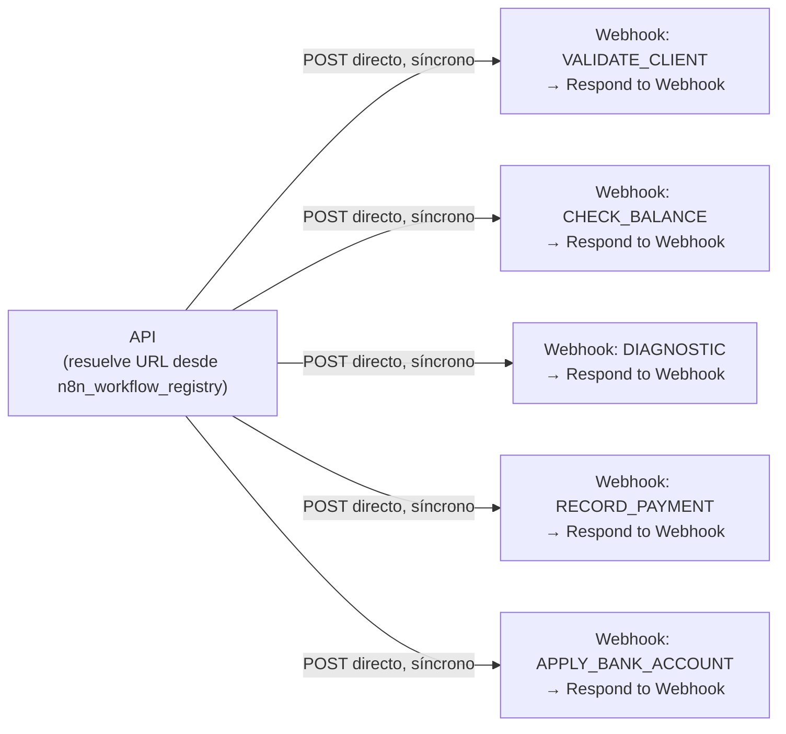

# 04_N8N_WORKFLOW_SPEC.md (v3 — n8n solo integraciones, registro en DB)

## 1. Rol de n8n (recordatorio, ya reducido)

n8n es **exclusivamente el ejecutor de integraciones con sistemas externos reales** (contrato, saldo, diagnóstico MikroTik, pagos, cuentas bancarias). Ya no hace interpretación de lenguaje, OCR, transcripción de audio, ni composición de respuesta — eso vive en la API (`AIProviderPort`, `03_API_CONTRACT.md` §A). n8n nunca decide transiciones de negocio, nunca es dueño de memoria de conversación, nunca envía directamente al canal (WhatsApp). Ejecuta lo que la API le pide y responde síncronamente, en el mismo request.

## 2. Patrón real: flujos independientes, entrada Webhook, salida Respond-to-Webhook

No existe un "workflow dispatcher" ni un `Switch` central. Cada acción de negocio es su propio workflow de n8n, con:
- **Entrada**: nodo `Webhook`, URL propia (una por workflow).
- **Salida**: nodo `Respond to Webhook`, responde en el mismo request HTTP que lo disparó.

La API resuelve la URL de cada acción desde `n8n_workflow_registry` (tabla en Postgres, §7 — ya no variables de entorno) y llama directo. No hay capa intermedia de n8n que enrute — el enrutamiento lo hace la API eligiendo qué URL llamar según el paso que decide el motor de workflow (`02_STATE_MACHINE.md`).



Esto es el mismo patrón `toolWorkflow` por función que ya usabas en el sistema legacy (un sub-workflow por herramienta) — se conserva. Lo que cambia es **quién decide llamarlo**: antes lo decidía el LLM con libertad total; ahora lo decide la API según el estado del `Case`, con `input` ya resuelto (nunca inventado por el LLM), y **quién interpreta lenguaje**: antes el agente de IA vivía dentro de n8n, ahora vive en la API.

## 3. Contrato por acción (síncrono) — confirmado, todas las acciones responden rápido

`POST {URL resuelta desde n8n_workflow_registry}` (URL de producción, nunca `/webhook-test/…`)

Request (API → n8n):
```json
{
  "correlationId": "corr_9f1c...",
  "executionId": "exec_01HZY...",
  "idempotencyKey": "case_123:CHECK_BALANCE:hash(input)",
  "caseId": "case_123",
  "conversationId": "conv_456",
  "input": { "nationalId": "1205500216" }
}
```

Response (n8n → API, mismo request vía `Respond to Webhook`):
```json
{ "success": true, "result": { "hasDebt": false, "balance": 0 }, "error": null }
```
o en error:
```json
{ "success": false, "result": null, "error": { "type": "EXTERNAL_SERVICE_ERROR", "message": "MikroTik timeout", "retryable": true } }
```

La API, al recibir la respuesta HTTP, persiste `workflow_execution` como `COMPLETED`/`FAILED` en el mismo ciclo.

**Confirmado**: todas las acciones (incluida `DIAGNOSTIC`, que también llama a otra API pero responde síncrono) usan este patrón — no hay excepción asíncrona. Si en el futuro alguna acción nueva no pudiera responder rápido, sería la única en usar un patrón de callback aparte (no contemplado en esta versión, se evalúa si aparece el caso real).

### 3.1 Ejemplo — `DIAGNOSTIC` (datos técnicos resueltos por la API, no por el LLM)
```json
{ "input": { "sector": "pomasqui", "oltName": "bicentenario", "pon": "3", "serial": "D011A66CB67C" } }
```

## 4. Interpretación, OCR y composición de respuesta — ya NO viven en n8n

Movidos a `AIProviderPort` en la API (`03_API_CONTRACT.md` §A). Esto significa:
- No hay workflow `n8n-interpret-message`.
- No hay agente LangChain, ni Postgres Chat Memory/pgvector, ni credenciales de Ollama configuradas *dentro de n8n* — el cliente HTTP hacia Ollama (u otro provider) vive en el `OllamaAdapter` del código de la API.
- El OCR de comprobantes de pago y la transcripción de audio también se resuelven vía el mismo port (`extractReceiptData`, `transcribeAudio`), no como nodos de n8n.

Si más adelante se decide que alguna pieza de IA sí conviene ejecutarla en n8n (por ejemplo, reutilizar un nodo de visión ya configurado), se documenta como una acción síncrona más (§3), nunca mezclada con las acciones de negocio existentes — decisión pendiente de confirmar, no asumida por defecto.

## 5. Qué NO debe existir en el n8n nuevo (a diferencia del legacy auditado)

- **Sin `WhatsApp Trigger` nativo.** Único punto de entrada de WhatsApp: la API.
- **Sin nodo de envío directo a WhatsApp.** n8n nunca llama al canal; solo devuelve resultados a la API.
- **Sin Data Table de buffer de mensajes / debounce en n8n.** El buffer vive en la API (Redis), ver `02_STATE_MACHINE.md` §12.
- **Sin agente de IA ni memoria conversacional dentro de n8n.** Ver §4.
- **Sin tool `disable_agent`** ni ninguna forma de que n8n cambie `automation_state` directamente. La API decide escalar a partir de `error.type`/`retryable`.
- **Sin que ningún workflow reciba como "parámetro obligatorio" datos técnicos del contrato** (`sector`, `oltName`, `pon`, `serial`). Esos valores los inyecta la API en `input` desde `case.context.data.contract`.
- **Sin URLs hardcodeadas en nodos.** Las URLs que n8n necesita llamar hacia la API (si alguna vez las hay) van en variable de entorno/credencial.
- **Sin usar `/webhook-test/…`.** Todos los workflows de acción se publican en su URL de producción.

## 6. Categorías de workflows de n8n (`n8n_workflow_registry.category`)

No todos los workflows de n8n son pasos de un `Case`. Se distinguen tres usos, y solo el primero lo llama el motor de workflow durante una conversación:

### 6.1 `case_action` — pasos de un `WorkflowDefinition`, compartidos entre workflows
Confirmado con tus flujos reales: `VALIDATE_CLIENT` (`find-client-contract`) y `CHECK_BALANCE` (`check-balance`) son **genéricos** — no saben nada de "soporte" ni de ningún workflow en particular, solo reciben una cédula y devuelven datos. Se registran una sola vez en el catálogo y los usa cualquier `WorkflowDefinition` que los necesite (`SUPPORT_INTERNET` hoy; `BILLING_BALANCE`/`SALES_PACKAGES` más adelante sin duplicar nada).

`DIAGNOSTIC`/`CONTINUE_DIAGNOSTIC` sí son específicos de `SUPPORT_INTERNET` (proxies hacia tu microservicio de diagnóstico), pero siguen siendo `case_action` — la diferencia entre "compartida" y "específica" no es estructural, es solo cuántos `WorkflowDefinition` la referencian.

### 6.2 `GENERAL_INQUIRY` — Consultas abiertas con RAG Nativo en Backend
El flujo **`GENERAL_INQUIRY`** atiende consultas abiertas (números de cuenta, ubicación de oficinas, planes, promociones, cobertura general) de forma **100% nativa en el Backend** mediante [`RagService`](../../src/core/modules/ai/application/services/rag.service.ts) (PGVector + Búsqueda Híbrida Vectorial + Síntesis LLM).

- **Sin intermediación de n8n para RAG**: Las consultas a la base de conocimiento y la ingesta de documentos (PDF parsing, chunking, embeddings) se ejecutan directamente en la API en milisegundos.
- **Escalación**: Si el RAG no encuentra información suficiente (`found: false` o confianza < 60%), el caso no inventa datos y se escala al **Pool de Triage (General)** para que un Administrador o Manager lo revise o reclasifique.

### 6.3 Workflows de integración externa en n8n
n8n se utiliza **exclusivamente para integraciones y microservicios externos** (MikroTik, CRMs, pasarelas de pago, diagnóstico de red):
1. `VALIDATE_CLIENT` (consulta de contratos y credenciales por cédula)
2. `CHECK_BALANCE` (consulta de facturación y deudas en CRM/ERP)
3. `DIAGNOSTIC` y `CONTINUE_DIAGNOSTIC` (proxy al microservicio técnico de diagnóstico de red)
4. `RECORD_PAYMENT` (registro y aplicación de pagos/comprobantes)
5. `APPLY_BANK_ACCOUNT` (solicitud de cuentas bancarias)

## 7. Registro de acciones → URL (catálogo en base de datos, no `.env`)

Tabla `n8n_workflow_registry` (`01_DATA_MODEL.md` §2), gestionable en caliente vía `PUT/DELETE /api/admin/n8n-workflows/:action` (`03_API_CONTRACT.md` §C.2).

```sql
INSERT INTO n8n_workflow_registry (action, category, url, description) VALUES
  ('VALIDATE_CLIENT',       'case_action',  'https://localhost:5678/webhook/find-client-contract', 'Busca contrato(s) y datos técnicos por cédula; puede devolver más de uno'),
  ('CHECK_BALANCE',         'case_action',  'https://localhost:5678/webhook/check-balance',         'Consulta saldo/deuda'),
  ('DIAGNOSTIC',            'case_action',  'https://localhost:5678/webhook/do-diagnostic',         'Diagnóstico técnico inicial (proxy a microservicio propio)'),
  ('CONTINUE_DIAGNOSTIC',   'case_action',  'https://localhost:5678/webhook/continue-diagnostic',   'Continúa diagnóstico con el mensaje textual del usuario'),
  ('RECORD_PAYMENT',        'case_action',  'https://localhost:5678/webhook/record-payment',        'Registra un pago (idempotente por idempotencyKey)'),
  ('APPLY_BANK_ACCOUNT',    'case_action',  'https://localhost:5678/webhook/apply-bank-account',    'Devuelve cuentas bancarias para depósito / transferencia');
```

> **Estado local (2026-08-08):** Los 7 `case_action` + `UPLOAD_RAG_DOCUMENT` están construidos y activos en el n8n de `docker-compose`. URLs de producción: `http://localhost:5678/webhook/record-payment`, `…/apply-bank-account`, `…/query-knowledge-base`, y form `http://localhost:5678/form/cargar-documentos`. JSON versionado en `n8n/`. Tablas de efecto: `n8n_recorded_payments` / `n8n_bank_account_requests` (`migrations/0008_n8n_payment_bank_tables.sql`).
### 7.1 Ejemplo — `DIAGNOSTIC` (input en camelCase, el nodo de n8n mapea a `olt_name` al llamar al microservicio)
```json
{ "input": { "sector": "pomasqui", "oltName": "bicentenario", "pon": "3", "serial": "D011A66CB67C", "conversationId": "conv_456" } }
```
### 7.2 Ejemplo — `CONTINUE_DIAGNOSTIC` (input real)
```json
{ "input": { "conversationId": "conv_456", "message": "la luz está en rojo" } }
```
El texto de `message` aquí es el **mensaje crudo del cliente**, no entidades interpretadas — tu microservicio de diagnóstico hace sus propias preguntas técnicas de seguimiento, así que el paso `WAITING_USER_DIAGNOSTIC` de `SUPPORT_INTERNET` reenvía el texto tal cual llegó, no una versión reinterpretada por el `AIProviderPort`.

Agregar una acción nueva = una fila nueva (por API o por migración de seed) — nunca implica tocar el motor de workflow de la API (Open/Closed, `docs/skills/solid-principles.md`).

## 8. Corrección de las tools legacy detectadas en la auditoría

El workflow legacy (`initial-whatsapp-api.json`) tenía `record_full_payment`, `record_incomplete_payment` y `apply_for_bank_accounts` apuntando por error al mismo sub-workflow `Check_Balance`. Al reconstruir cada uno como workflow independiente (§2), cada uno debe tener su propia URL real registrada en `n8n_workflow_registry` y probarse contra el sistema de pagos antes de dar por completa esta pieza.

## 9. Migración de los 4 workflows existentes a la nueva instancia + nuevo contrato

Los workflows `find-client-contract`, `check-balance`, `do-diagnostic`, `continue-diagnostic` funcionaban contra la arquitectura anterior (llamadas directas del agente de IA con `$json.body.{campo}` plano). Al importarlos a la instancia nueva de n8n, necesitan **tres ajustes**, no solo reimportarse tal cual:

1. **Recredenciales**: Google Sheets OAuth (`find-client-contract`, `check-balance`) y cualquier credencial de Postgres/Ollama que use el flujo de RAG — los IDs de credencial del JSON exportado no existen en la instancia nueva, hay que recrearlas y reconectar los nodos.
2. **Rutas de acceso a los datos de entrada**: los nodos que hoy leen `{{ $json.body.id }}` deben leer `{{ $json.body.input.id }}` (o el campo que corresponda) — el nuevo contrato (`03_API_CONTRACT.md` §B) envía los datos de negocio anidados bajo `input`, no en la raíz del body. Revisar cada expresión que referencia `$json.body.*` en los 4 flujos.
3. **Respuesta envuelta en el formato estándar**: hoy el nodo `Respond to Webhook` devuelve el resultado de `Format data` tal cual (plano). Debe envolverse en `{ success, result, error }` (§10). Esto es el cambio más importante — sin esto, la API no puede distinguir éxito de error de forma consistente entre acciones.

**Nota sobre `do-diagnostic`/`continue-diagnostic`**: el `HTTP Request` node de esos dos flujos ya hace el mapeo campo por campo hacia el microservicio de diagnóstico (`sector`, `olt_name`, `pon`, `serial`), así que **no hace falta tocar ese mapeo** — solo el punto 2 de arriba (`$json.body.input.sector` en vez de `$json.body.sector`). El contrato de la API sigue enviando `oltName` en camelCase; el propio nodo ya se encarga de renombrarlo a `olt_name` al llamar al microservicio, así que no hay nada que generalizar ahí más allá de ajustar la ruta de lectura.

## 10. Validación del header interno y manejo de errores explícito por acción

**Header interno**: cada workflow de acción debe validar `X-Internal-Api-Key` (`03_API_CONTRACT.md` §F) al inicio, antes de tocar cualquier sistema externo — un nodo `IF`/`Function` que compare el header contra el valor esperado (credencial/variable de entorno de n8n) y, si no coincide, responda `401` con `{ success: false, result: null, error: { type: "VALIDATION_ERROR", message: "Unauthorized", retryable: false } }` sin ejecutar el resto del flujo.

**Manejo de errores por acción** — hoy ninguno de los 4 flujos tiene una rama de error explícita (si Google Sheets no encuentra la fila, o el microservicio de diagnóstico responde con error, el flujo puede fallar de forma no controlada en vez de devolver el shape esperado). Mapeo sugerido:

| Acción | Condición de error | `DomainErrorType` | `retryable` |
|---|---|---|---|
| `VALIDATE_CLIENT` | Google Sheets no devuelve fila para la cédula | `NOT_FOUND` | `false` |
| `VALIDATE_CLIENT` | Falla la API de Google Sheets (timeout/rate limit) | `EXTERNAL_SERVICE_ERROR` | `true` |
| `CHECK_BALANCE` | Sin fila para la cédula | `NOT_FOUND` | `false` |
| `DIAGNOSTIC`/`CONTINUE_DIAGNOSTIC` | Microservicio de diagnóstico no responde / timeout | `TIMEOUT` | `true` |
| `DIAGNOSTIC`/`CONTINUE_DIAGNOSTIC` | Microservicio responde 4xx (input inválido) | `VALIDATION_ERROR` | `false` |
| `RECORD_PAYMENT` | Comprobante/monto no coincide, referencia inválida | `BUSINESS_ERROR` | `false` |
| `QUERY_KNOWLEDGE_BASE` | Sin resultados relevantes en el vector store | no es error — `result: { found: false }` con `success: true` (es una respuesta válida, no una falla) | n/a |

Para no duplicar esta lógica de envoltura en cada uno de los 7 flujos, conviene un patrón reutilizable simple: un nodo `Set` al final de la rama de éxito y otro al final de cada rama de error, ambos con la misma forma de salida — documentarlo una vez (aquí) y replicarlo, ya que n8n no comparte código fácilmente entre workflows sin un sub-workflow dedicado (que agregaría una llamada HTTP extra e innecesaria para algo tan simple).

## 11. Fixtures de prueba (éxito y error) por acción

Base para probar cada workflow de forma aislada (vía curl/Postman directo al webhook de n8n) antes de que la API los llame, y para los tests de integración de la Etapa 4:

```json
// VALIDATE_CLIENT — éxito
{ "input": { "id": "1205500216" } }
// → { "success": true, "result": { "found": true, "contractNumbers": 1, "contracts": [{ "id": "1205500216", "name": "...", "router": { "sector": "pomasqui", "olt_name": "bicentenario", "pon": "3", "serial": "D011A66CB67C" } }] }, "error": null }

// VALIDATE_CLIENT — no encontrado
{ "input": { "id": "0000000000" } }
// → { "success": true, "result": { "found": false, "contractNumbers": 0, "contracts": [] }, "error": null }
// nota: "no encontrado" es un resultado válido de negocio (found:false), no un error de transporte — la API decide qué hacer con eso.

// CHECK_BALANCE — con deuda
{ "input": { "id": "1205500216" } }
// → { "success": true, "result": { "hasDebt": true, "debt": 45.50 }, "error": null }

// DIAGNOSTIC — éxito
{ "input": { "sector": "pomasqui", "oltName": "bicentenario", "pon": "3", "serial": "D011A66CB67C", "conversationId": "conv_456" } }
// → { "success": true, "result": { "status": "WAITING_USER", "question": "¿La luz de la ONU está roja o verde?" }, "error": null }

// DIAGNOSTIC — microservicio caído
{ "input": { "sector": "pomasqui", "oltName": "bicentenario", "pon": "3", "serial": "D011A66CB67C", "conversationId": "conv_456" } }
// → { "success": false, "result": null, "error": { "type": "EXTERNAL_SERVICE_ERROR", "message": "diagnostic service unreachable", "retryable": true } }

// CONTINUE_DIAGNOSTIC — éxito, resuelto
{ "input": { "conversationId": "conv_456", "message": "está en rojo" } }
// → { "success": true, "result": { "status": "COMPLETED", "diagnostic": "ONU_UNREACHABLE" }, "error": null }

// QUERY_KNOWLEDGE_BASE — encontrado
{ "input": { "question": "¿qué paquetes de 500 megas tienen?" } }
// → { "success": true, "result": { "found": true, "answer": "...", "sources": ["catalogo-2026.pdf"] }, "error": null }

// QUERY_KNOWLEDGE_BASE — sin resultado
{ "input": { "question": "¿venden televisores?" } }
// → { "success": true, "result": { "found": false }, "error": null }

// RECORD_PAYMENT — éxito (monto alineado a deuda en Sheets / sistema externo)
{ "idempotencyKey": "case_123:RECORD_PAYMENT:hash", "input": { "nationalId": "1205500216", "amount": 30.8, "reference": "REF-OK-001", "date": "2026-08-08" } }
// → { "success": true, "result": { "recorded": true, "amount": 30.8, "reference": "REF-OK-001", "nationalId": "1205500216", "date": "2026-08-08" }, "error": null }

// RECORD_PAYMENT — monto no coincide
{ "idempotencyKey": "case_123:RECORD_PAYMENT:hash2", "input": { "nationalId": "1205500216", "amount": 1, "reference": "BAD" } }
// → { "success": false, "result": null, "error": { "type": "BUSINESS_ERROR", "message": "Monto no coincide…", "retryable": false } }

// APPLY_BANK_ACCOUNT — éxito
{ "idempotencyKey": "case_123:APPLY_BANK_ACCOUNT:hash", "input": { "nationalId": "1205500216" } }
// → { "success": true, "result": { "accounts": [{ "bank": "…", "accountType": "…", "accountNumber": "…", "holder": "…", "taxId": "…" }], "nationalId": "1205500216" }, "error": null }

// Header inválido (aplica a cualquier acción)
// sin X-Internal-Api-Key o con valor incorrecto
// → 401, { "success": false, "result": null, "error": { "type": "VALIDATION_ERROR", "message": "Unauthorized", "retryable": false } }
```
