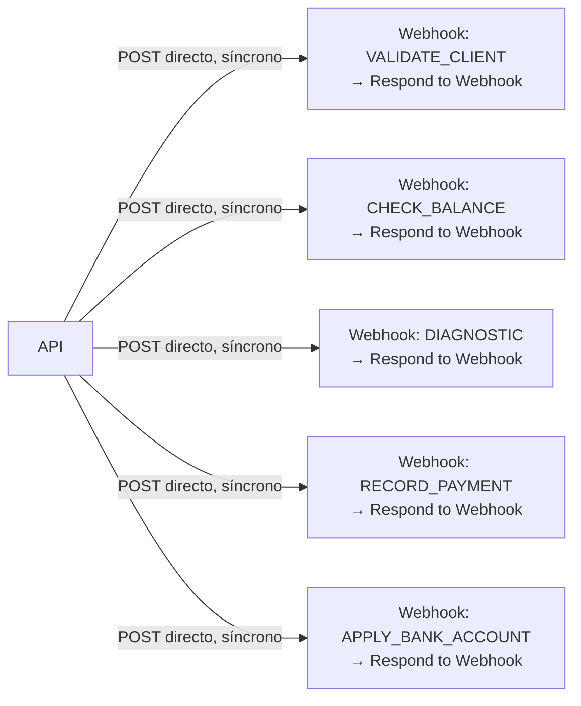

# 04_N8N_WORKFLOW_SPEC.md (v2 — corregido)

## 1. Rol de n8n (recordatorio)

n8n es **motor de integración/automatización**. Nunca decide transiciones de negocio, nunca es dueño de la memoria oficial de la conversación, nunca envía directamente al canal (WhatsApp). Ejecuta lo que la API le pide y le responde, síncronamente, en el mismo request.

## 2. Patrón real: flujos independientes, entrada Webhook, salida Respond-to-Webhook

No existe un "workflow dispatcher" ni un `Switch` central. Cada capacidad de negocio es su propio workflow de n8n, con:
- **Entrada**: nodo `Webhook`, URL propia (una por workflow).
- **Salida**: nodo `Respond to Webhook`, responde en el mismo request HTTP que lo disparó.

La API mantiene un **registro de acciones → URL** (uno por cada workflow existente/nuevo) y llama directo a la URL que corresponde según la acción que el motor de workflow (`02_STATE_MACHINE.md`) decide ejecutar. No hay capa intermedia de n8n que enrute — el enrutamiento lo hace la API eligiendo qué URL llamar.



Esto es exactamente el patrón `toolWorkflow` por función que ya usabas en el sistema legacy (un sub-workflow por herramienta) — se conserva. Lo único que cambia es **quién decide llamarlo**: antes lo decidía el LLM con libertad total; ahora lo decide la API según el estado del `Case`, y el `input` que recibe cada webhook ya viene resuelto (nunca inventado por el LLM).

## 3. Contrato por acción (síncrono)

`POST {URL_DEL_WORKFLOW_DE_LA_ACCIÓN}` (URL de producción, nunca `/webhook-test/…`)

Request (API → n8n):
```json
{
  "correlationId": "corr_9f1c...",
  "executionId": "exec_01HZY...",
  "idempotencyKey": "case_123:CHECK_BALANCE:hash(input)",
  "caseId": "case_123",
  "conversationId": "conv_456",
  "input": { "nationalId": "1205500216" }
}
```

Response (n8n → API, mismo request vía `Respond to Webhook`):
```json
{ "success": true, "result": { "hasDebt": false, "balance": 0 }, "error": null }
```
o en error:
```json
{ "success": false, "result": null, "error": { "type": "EXTERNAL_SERVICE_ERROR", "message": "MikroTik timeout", "retryable": true } }
```

La API, al recibir la respuesta HTTP, persiste `workflow_execution` como `COMPLETED`/`FAILED` en el mismo ciclo — no hace falta un endpoint de callback separado para el caso general.

### 3.1 Ejemplo — `DIAGNOSTIC` (datos técnicos resueltos por la API, no por el LLM)
```json
{ "input": { "sector": "pomasqui", "oltName": "bicentenario", "pon": "3", "serial": "D011A66CB67C" } }
```

## 4. ¿Alguna acción necesita ser asíncrona?

Si alguna de tus acciones (por ejemplo `DIAGNOSTIC` contra MikroTik) puede tardar más de lo razonable para un request HTTP síncrono, esa acción específica necesita un patrón distinto: la API dispara la acción, no espera el `Respond to Webhook` inline, y n8n le avisa el resultado más tarde vía `POST /api/webhooks/n8n/action-result` (`03_API_CONTRACT.md`). **Dime si este es tu caso hoy** (¿cuánto tarda típicamente `DIAGNOSTIC`?) para dejar solo esa acción como asíncrona y todo lo demás síncrono, en vez de complicar el contrato completo por una excepción.

## 5. `n8n-interpret-message` — único workflow nuevo a construir

Disparado por la API cuando llega un mensaje nuevo que requiere interpretación. **Incluye el procesamiento de multimedia como parte del mismo flujo**, no como un workflow separado:

Entrada (la API llama a este webhook):
```json
{
  "correlationId": "...",
  "conversationId": "...",
  "messageId": "...",
  "type": "text | audio | image",
  "text": "...",
  "mediaUrl": "...",
  "mimeType": "...",
  "conversationSnapshot": { "activeCase": { "workflowType": "SUPPORT_INTERNET", "pendingQuestion": "..." } }
}
```

Pasos internos:
1. `Switch` por `type`: si `audio` → transcribir; si `image` → OCR/descripción. El resultado (texto transcrito, o datos extraídos del recibo: monto, fecha, referencia) se une al texto que va al agente de IA como **entrada**, no como un flujo separado.
   - Ejemplo concreto de lo que preguntabas: si la imagen es un comprobante de pago, el OCR extrae `{ amount, date, reference }` y eso se refleja directamente en `entities` de la interpretación (`intent: "billing.record_payment"`, `entities: { amount: 45.00, reference: "ABC123", date: "2026-08-07" }`). La API, al recibir eso, ya tiene lo necesario para llamar directo al webhook de `RECORD_PAYMENT` (§3) sin preguntarle nada más al cliente — o para pedir el dato puntual que falte, si el OCR no pudo leerlo todo.
2. Agente LangChain + Ollama/Qwen, con memoria de continuidad lingüística (Postgres Chat Memory/pgvector) **solo como contexto de redacción**, nunca como fuente de verdad de estado — el prompt recibe explícitamente `conversationSnapshot.activeCase`.
3. El agente produce **únicamente** `{ type, intent, entities, confidence }` (enum cerrado, `03_API_CONTRACT.md` §B.2). Sin tools de acción de negocio en este workflow (sin `check_balance`, sin `disable_agent`).
4. `POST /api/webhooks/n8n/interpretation` con el resultado.

## 6. Qué NO debe existir en el n8n nuevo (a diferencia del workflow legacy auditado)

- **Sin `WhatsApp Trigger` nativo.** Único punto de entrada de WhatsApp: la API.
- **Sin nodo de envío directo a WhatsApp.** n8n nunca llama al canal; solo devuelve resultados a la API.
- **Sin Data Table de buffer de mensajes / debounce en n8n.** La agrupación de ráfagas y la serialización por conversación se resuelven en la cola de la API (Redis).
- **Sin tool `disable_agent`** ni ninguna tool que le dé al LLM la capacidad de cambiar `automation_state` directamente. La API decide escalar a partir de `error.type`/`retryable` que devuelve cada webhook de acción, o de baja confianza sostenida.
- **Sin que el LLM reciba como "parámetros obligatorios" datos técnicos del contrato** (`sector`, `olt_name`, `pon`, `serial`). Esos valores los inyecta la API en `input` desde `case.context.data.contract`.
- **Sin URLs hardcodeadas en nodos.** Toda URL (de la API hacia n8n, y de n8n hacia la API) es variable de entorno/credencial.
- **Sin usar `/webhook-test/…`.** Todos los workflows (interpretación + cada acción) se publican en su URL de producción.

## 7. Registro de acciones → URL (lado API)

En vez de una sola `N8N_ACTION_WEBHOOK_URL`, la API necesita un mapa, uno por cada workflow independiente que ya tienes o vas a construir:

```
N8N_WEBHOOK_VALIDATE_CLIENT=https://.../webhook/validate-client
N8N_WEBHOOK_CHECK_BALANCE=https://.../webhook/check-balance
N8N_WEBHOOK_DIAGNOSTIC=https://.../webhook/diagnostic
N8N_WEBHOOK_CONTINUE_DIAGNOSTIC=https://.../webhook/continue-diagnostic
N8N_WEBHOOK_RECORD_PAYMENT=https://.../webhook/record-payment
N8N_WEBHOOK_APPLY_BANK_ACCOUNT=https://.../webhook/apply-bank-account
N8N_WEBHOOK_INTERPRET_MESSAGE=https://.../webhook/interpret-message
```

Se agrega una entrada nueva cada vez que se agrega una acción/workflow — sin tocar el motor de workflow de la API (Open/Closed, `docs/skills/solid-principles.md`).

## 8. Corrección de las tools legacy detectadas en la auditoría

El workflow legacy (`initial-whatsapp-api.json`) tenía `record_full_payment`, `record_incomplete_payment` y `apply_for_bank_accounts` apuntando por error al mismo sub-workflow `Check_Balance`. Al reconstruir cada uno como workflow independiente (§2), cada uno debe tener su propia URL real y probarse contra el sistema de pagos antes de dar por completa esta pieza.
