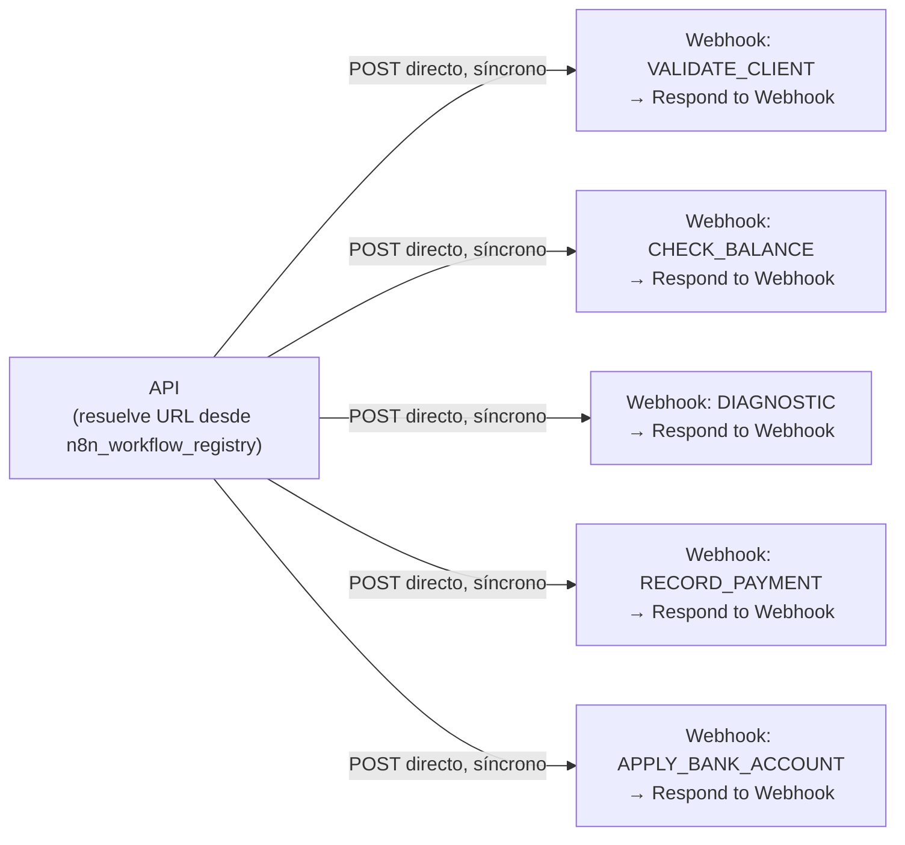

# 04_N8N_WORKFLOW_SPEC.md (v3 — n8n solo integraciones, registro en DB)

## 1. Rol de n8n (recordatorio, ya reducido)

n8n es **exclusivamente el ejecutor de integraciones con sistemas externos reales** (contrato, saldo, diagnóstico MikroTik, pagos, cuentas bancarias). Ya no hace interpretación de lenguaje, OCR, transcripción de audio, ni composición de respuesta — eso vive en la API (`AIProviderPort`, `03_API_CONTRACT.md` §A). n8n nunca decide transiciones de negocio, nunca es dueño de memoria de conversación, nunca envía directamente al canal (WhatsApp). Ejecuta lo que la API le pide y responde síncronamente, en el mismo request.

## 2. Patrón real: flujos independientes, entrada Webhook, salida Respond-to-Webhook

No existe un "workflow dispatcher" ni un `Switch` central. Cada acción de negocio es su propio workflow de n8n, con:
- **Entrada**: nodo `Webhook`, URL propia (una por workflow).
- **Salida**: nodo `Respond to Webhook`, responde en el mismo request HTTP que lo disparó.

La API resuelve la URL de cada acción desde `n8n_workflow_registry` (tabla en Postgres, §7 — ya no variables de entorno) y llama directo. No hay capa intermedia de n8n que enrute — el enrutamiento lo hace la API eligiendo qué URL llamar según el paso que decide el motor de workflow (`02_STATE_MACHINE.md`).



Esto es el mismo patrón `toolWorkflow` por función que ya usabas en el sistema legacy (un sub-workflow por herramienta) — se conserva. Lo que cambia es **quién decide llamarlo**: antes lo decidía el LLM con libertad total; ahora lo decide la API según el estado del `Case`, con `input` ya resuelto (nunca inventado por el LLM), y **quién interpreta lenguaje**: antes el agente de IA vivía dentro de n8n, ahora vive en la API.

## 3. Contrato por acción (síncrono) — confirmado, todas las acciones responden rápido

`POST {URL resuelta desde n8n_workflow_registry}` (URL de producción, nunca `/webhook-test/…`)

Request (API → n8n):
```json
{
  "correlationId": "corr_9f1c...",
  "executionId": "exec_01HZY...",
  "idempotencyKey": "case_123:CHECK_BALANCE:hash(input)",
  "caseId": "case_123",
  "conversationId": "conv_456",
  "input": { "nationalId": "1205500216" }
}
```

Response (n8n → API, mismo request vía `Respond to Webhook`):
```json
{ "success": true, "result": { "hasDebt": false, "balance": 0 }, "error": null }
```
o en error:
```json
{ "success": false, "result": null, "error": { "type": "EXTERNAL_SERVICE_ERROR", "message": "MikroTik timeout", "retryable": true } }
```

La API, al recibir la respuesta HTTP, persiste `workflow_execution` como `COMPLETED`/`FAILED` en el mismo ciclo.

**Confirmado**: todas las acciones (incluida `DIAGNOSTIC`, que también llama a otra API pero responde síncrono) usan este patrón — no hay excepción asíncrona. Si en el futuro alguna acción nueva no pudiera responder rápido, sería la única en usar un patrón de callback aparte (no contemplado en esta versión, se evalúa si aparece el caso real).

### 3.1 Ejemplo — `DIAGNOSTIC` (datos técnicos resueltos por la API, no por el LLM)
```json
{ "input": { "sector": "pomasqui", "oltName": "bicentenario", "pon": "3", "serial": "D011A66CB67C" } }
```

## 4. Interpretación, OCR y composición de respuesta — ya NO viven en n8n

Movidos a `AIProviderPort` en la API (`03_API_CONTRACT.md` §A). Esto significa:
- No hay workflow `n8n-interpret-message`.
- No hay agente LangChain, ni Postgres Chat Memory/pgvector, ni credenciales de Ollama configuradas *dentro de n8n* — el cliente HTTP hacia Ollama (u otro provider) vive en el `OllamaAdapter` del código de la API.
- El OCR de comprobantes de pago y la transcripción de audio también se resuelven vía el mismo port (`extractReceiptData`, `transcribeAudio`), no como nodos de n8n.

Si más adelante se decide que alguna pieza de IA sí conviene ejecutarla en n8n (por ejemplo, reutilizar un nodo de visión ya configurado), se documenta como una acción síncrona más (§3), nunca mezclada con las acciones de negocio existentes — decisión pendiente de confirmar, no asumida por defecto.

## 5. Qué NO debe existir en el n8n nuevo (a diferencia del legacy auditado)

- **Sin `WhatsApp Trigger` nativo.** Único punto de entrada de WhatsApp: la API.
- **Sin nodo de envío directo a WhatsApp.** n8n nunca llama al canal; solo devuelve resultados a la API.
- **Sin Data Table de buffer de mensajes / debounce en n8n.** El buffer vive en la API (Redis), ver `02_STATE_MACHINE.md` §12.
- **Sin agente de IA ni memoria conversacional dentro de n8n.** Ver §4.
- **Sin tool `disable_agent`** ni ninguna forma de que n8n cambie `automation_state` directamente. La API decide escalar a partir de `error.type`/`retryable`.
- **Sin que ningún workflow reciba como "parámetro obligatorio" datos técnicos del contrato** (`sector`, `olt_name`, `pon`, `serial`). Esos valores los inyecta la API en `input` desde `case.context.data.contract`.
- **Sin URLs hardcodeadas en nodos.** Las URLs que n8n necesita llamar hacia la API (si alguna vez las hay) van en variable de entorno/credencial.
- **Sin usar `/webhook-test/…`.** Todos los workflows de acción se publican en su URL de producción.

## 6. Registro de acciones → URL (catálogo en base de datos, no `.env`)

Tabla `n8n_workflow_registry` (`01_DATA_MODEL.md` §2), gestionable en caliente vía `PUT/DELETE /api/admin/n8n-workflows/:action` (`03_API_CONTRACT.md` §C.2) — agregar o cambiar una URL de acción no requiere redeploy ni tocar variables de entorno.

Seed inicial (migración, no hardcodeado en código de aplicación):

```sql
INSERT INTO n8n_workflow_registry (action, url, description) VALUES
  ('VALIDATE_CLIENT',       'https://n8n.example.com/webhook/validate-client',       'Busca contrato y datos técnicos del cliente'),
  ('CHECK_BALANCE',         'https://n8n.example.com/webhook/check-balance',         'Consulta saldo/deuda'),
  ('DIAGNOSTIC',            'https://n8n.example.com/webhook/diagnostic',            'Diagnóstico técnico inicial (MikroTik)'),
  ('CONTINUE_DIAGNOSTIC',   'https://n8n.example.com/webhook/continue-diagnostic',   'Continúa diagnóstico con respuesta del usuario'),
  ('RECORD_PAYMENT',        'https://n8n.example.com/webhook/record-payment',        'Registra un pago (idempotente por idempotencyKey)'),
  ('APPLY_BANK_ACCOUNT',    'https://n8n.example.com/webhook/apply-bank-account',    'Solicitud de cuenta bancaria asociada');
```

Agregar una acción nueva = una fila nueva (por API o por migración de seed) — nunca implica tocar el motor de workflow de la API (Open/Closed, `docs/skills/solid-principles.md`).

## 7. Corrección de las tools legacy detectadas en la auditoría

El workflow legacy (`initial-whatsapp-api.json`) tenía `record_full_payment`, `record_incomplete_payment` y `apply_for_bank_accounts` apuntando por error al mismo sub-workflow `Check_Balance`. Al reconstruir cada uno como workflow independiente (§2), cada uno debe tener su propia URL real registrada en `n8n_workflow_registry` y probarse contra el sistema de pagos antes de dar por completa esta pieza.
